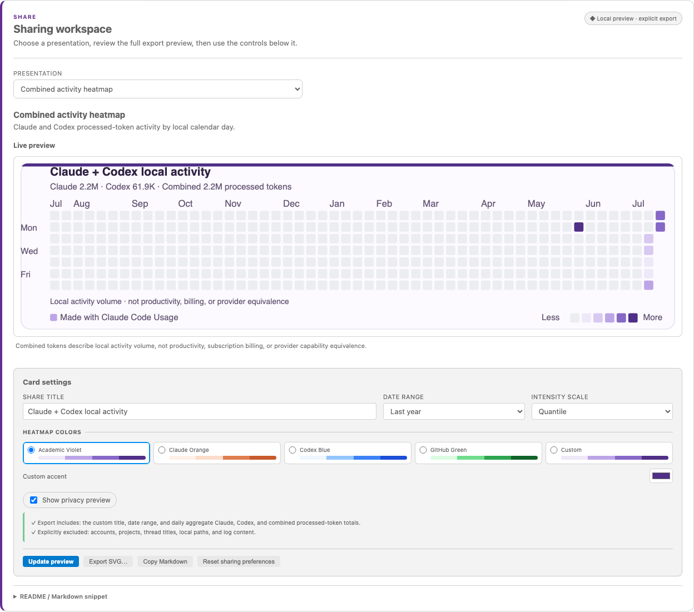

# Claude Code Usage

🌐 **Language**: [🏠 Main](README.md) | **English** | [Deutsch](README-de-DE.md) | [繁體中文](README-zh-TW.md) | [简体中文](README-zh-CN.md) | [日本語](README-ja.md) | [한국어](README-ko.md) | [Português (Brasil)](README-pt-BR.md) | [Bahasa Indonesia](README-id.md)

---

**Track Claude Code and OpenAI Codex token usage and quota locally in VS Code.**
Open the dashboard from the status bar to explore cache, models, sessions,
projects, and optional advice. [Install from the VS Code Marketplace](https://marketplace.visualstudio.com/items?itemName=growthjack.claude-code-usage).
This is not a billing tool: Claude costs and Codex API-equivalent values are estimates.

> **What it is:** a VS Code status-bar monitor that reads local Claude Code and Codex usage logs, shows provider-appropriate token and quota views, and offers optional advice for reducing avoidable overhead.
>
> **What it is _not_:** a billing tool. Claude costs and Codex API-equivalent values are estimates, not subscription charges or invoices. Refer to the relevant provider account for billing truth.

> Screenshots include English and Simplified Chinese. See the [main README](README.md) for the full feature reference.

## Screenshots

### Status bar


Hover the quota indicator for a breakdown:


### Dashboard


### v2.3 Codex and Compare


These five v2.3 captures use the production renderer, synthetic fixtures, and VS Code Light+/Dark+ theme variables—not personal usage or billing evidence. Native VSIX installation is checked separately.

- Codex shows **Today token usage** and separate **remaining quota**: 36% used means `wk 64%`. Hover shows utilisation bars, resets, and wrapped notes. Quota is last-observed local evidence, not a live balance.
- Period details start collapsed; sharing settings sit below the preview. Sharing is on by default with an off switch and quantile, logarithmic, or linear intensity.
- CLI calls count only when persistent sessions leave usage-bearing logs. Non-persisted calls cannot be backfilled; Today and Last 30 days use the configured timezone.
- Projects adds a Token-only 30/90-day project × day heatmap and stacked daily trend for both providers, with exact tooltips, explicit coverage, bounded rows, and an Other-projects tail.

## Features

- **Status bar** — today's cost, current-session cost, and real 5-hour / weekly quota (`5h:N% wk:N%`) read from Claude Code's own OAuth session. Zero configuration.
- **Quota format** — choose Built-in (default), 5-hour only, or Weekly only in ⚙ Settings; Custom reveals the optional template field.
- **Dashboard tabs** — Today / Last 30 Days / All Time, plus **Sessions / Projects / Content / Branches**, all sortable.
- **Stacked cost-composition charts** with a Y-axis and reference lines — see at a glance how much of each day / month went to input, output, cache-write and cache-read.
- **Content tab** — estimates which content consumes your tokens (your prompts vs. tool results vs. assistant output / thinking).
- **AI advice** (opt-in) — starts with local evidence and explainable actions. Optional BYOK personalisation defaults to aggregates only; prompt samples require separate consent. The exact full request is previewed before a separate Send action, and helpful / not-helpful / applied feedback stays local. Recommendations can be snoozed for a bounded period and return after expiry or on demand.
  Withdrawing advice consent immediately invalidates previews and cancels active advice requests; already transmitted bytes cannot be recalled.
- **Multi-vendor pricing** — Opus 4.x / Sonnet 4.x / Haiku 4.5 verified against Anthropic's public pricing; reference rates for OpenAI / Gemini / DeepSeek / Kimi / GLM / Qwen with family-aware fallback. `Refresh Token Pricing` pulls live LiteLLM data.
- **Personalisation** — language, timezone, decimal places, compact numbers, project grouping, dashboard auto-refresh toggle.

## What's new in v2.4

<details open>
<summary>Current release: status bar, smoother scrolling, and one sharing workspace</summary>

- **Bounded pricing diagnostics** — unknown-model warnings are deduplicated
  and capped per Extension Host lifetime, addressing the warning flood in
  [#122](https://github.com/ClaudeCodeUsage/ClaudeCodeUsage/issues/122).
  Already-expired analysis files
  keep their empty contribution without disrupting live-tail refreshes.
- **Current model prices** — dedicated Standard/cache rates for Opus 5.5,
  Sonnet 5.5, GPT-6.1 Sol, GPT-6 Sol and GPT-6 Luna. Unknown Codex IDs remain
  unpriced; fallback estimates do not become exact-price coverage.
- **Defensive refreshes** — malformed model metadata cannot abort a whole index
  or mutate shared prototypes. Aggregate buckets are copied once per update;
  worker results and manual price refreshes have explicit capacity limits.
- **Quieter updates and recovery** — auto-refresh pause applies to both pages,
  not background collection or the status bar. Manual refresh still works;
  failures retain verified data, and backfill/retry phases are clearly labelled.
  Unchanged hidden panels and weekly aggregates reuse bounded caches.
- **Exact previews and safe settings** — AI previews include the endpoint,
  protocol and model without silently changing providers. Share Card export
  writes the accepted SVG; edited controls require a new preview. Default reset
  preserves the API key, and Codex directory recovery stays visible on both pages.
- **Large-history refreshes** — unchanged Content attribution is cached while AI
  controls stay live. Display settings reuse completed index work, and old index
  results cannot overwrite refreshed prices.
  Today attribution is cached by calendar day: unchanged minute-spaced polls
  update countdowns without rescanning the full history within the hour. The
  hourly hidden-panel refresh still recomputes Content attribution once.
- **Upgrade safety** — unchanged polls keep accepted previews; changing Claude
  directories clears old data even while updates are paused. Existing API keys
  without an explicit protocol keep the prior Anthropic format. If preview
  reports a mismatch, select the intended format and URL in Settings and preview
  again before sending. New installs use the matching OpenAI-compatible default.
- **Codex status and scrolling** — today's processed tokens are the default
  compact metric, while weekly quota shows remaining capacity. Live panel
  updates briefly defer during scrolling, with a bounded delay.
- **One preview-first sharing workspace** — a full-width export preview now
  comes first, with controls below it and one presentation selector for the
  **Combined activity heatmap**, **Claude Share Card**, and **Claude token
  heatmap**. The combined presentation requires real data from both providers;
  both legacy presentations remain Claude-only.
- **Compatibility without duplicate panels** — `exportShareCard`,
  `exportHeatmap`, and `publishHeatmapToGitHub` remain available and open the
  matching presentation. `enableShareCard` is still the single visible sharing
  switch and defaults to on; retired `showHeatmap` state remains only for one
  release of compatibility and bounded clearing.
- **Strict local-artifact and provider boundaries** — selecting, previewing,
  and local SVG/Markdown export use materialized aggregates only and make no
  network request, GitHub sign-in, or profile/avatar/name lookup. Only the
  separate Claude-heatmap **Publish to GitHub** action can connect; it remains
  public-repository-only and confirms the exact target and create/overwrite
  action before writing. Combined activity does not claim billing,
  productivity, capability, or provider equivalence.



Production renderer, synthetic usage and VS Code theme variables; not an
installed-VSIX or real-account screenshot.

</details>

## What's new in v2.3

The v2.3 series added Codex tracking, provider-aware comparisons, honest
token accounting, weekly estimates, and month → day → hour drill-down.
For patch-level detail, see [CHANGELOG.md](CHANGELOG.md).

<details>
<summary>Read the v2.3 technical details</summary>

### Models and accounting

- **Refined throughout the v2.3 line** — GPT-6 Astra and Fable 5.1 model
  metadata, optional AWS Bedrock pricing, a fixed-reference display-currency
  selector, a Token-only 30/90-day project activity matrix, complete
  month/day/hour drill-downs, state-preserving refresh, accessible charts, and
  lower watcher/title-index overhead. Patch-level
  details stay in the changelog and GitHub Releases.
- Codex usage records are discovered only from `sessions/**/*.jsonl` and `archived_sessions/**/*.jsonl`; credential, database, and unknown files remain excluded. Separately, the extension streams exactly `$CODEX_HOME/session_index.jsonl` to map `id` to `thread_name` for truthful thread titles. Absolute paths are redacted and titles remain memory-only. Usage-record JSONL lines are streamed and temporarily parsed only to extract allowlisted usage and structural metadata; prompt, response, command, and tool-argument fields are not inspected or used for analysis, and are never retained or persisted.
- **Processed** means input + output, **uncached usage** means uncached input + output, **cached input** remains a subset of input, and reasoning remains a subset of output. The overview also shows input cache hit rate as cached input / input. Codex billing cost is not shown. Its first summary card is a clearly labelled API-equivalent cost estimate for the selected scope, and the All-time view shows the weekly trend on the same pricing basis; Claude / Codex / Compare keep each provider's accounting separate.
- Codex **Today** means the current calendar day in the configured timezone. It adds exact hourly API-equivalent cost beside a separate token-composition view; daily and monthly primary charts also default to API-equivalent cost while token composition stays separately visible. Only exact known-model prices contribute, so unknown models remain unpriced and pricing coverage stays visible. The additive, schema-3-compatible hourly sidecar keeps sparse buckets for the rolling last 30 days, is checkpointed and resumable, evicts day 31, and serves date expansion without reading JSONL on click. Codex monthly charts and tables list months oldest-first.
- Request-level attribution prefers valid `last_token_usage` components; its `total_tokens` is active-context size, not request usage. A full numeric total-plus-last signature suppresses only proven replay from the same pseudonymous rate-limit source or an immediately adjacent duplicate. Missing last snapshots fall back to cumulative lineage high-water. Upgrading triggers one automatic reindex, while the indexed subtotal remains visible throughout the pass.
- Claude and Codex All-time / Compare views calculate historical used equivalents directly from local token logs. The newest valid official reset observation anchors one sequence of unique, non-overlapping weekly periods, so each usage event is counted once; without a usable observation, usage-only rows fall back to Monday-to-Monday UTC calendar weeks. A genuinely different quota series with an overlapping, non-aligned future reset is a conflict; same-series observations remain one series and may be shown as a low-confidence approximation. It cannot create another current period, and period ranges are shown separately from reset times. Codex usage is stored in daily slices, and an account-wide `codex` observation may decorate both historical and current buckets. If an observed reset drifts from the seven-day grid, the sample is mapped to the display period containing its observation time; file-source uncertainty, reset drift, and daily boundary crossings lower confidence and are labelled approximate. File keys are not account identities, so eligible local files in one home are included together. If local quota series overlap, the current period uses the latest real observation for a low-confidence blended estimate; ambiguous completed periods, or periods without a usable observation, stay used-only rather than inventing an account split. Any coherent observed window—including the current one—can show total and unused durability estimates; attribution or boundary uncertainty lowers confidence instead of silently replacing the values with dashes. This display rule does not change the index schema or trigger a rebuild. Current official API rates are applied consistently across history. This is a proxy, not a bill, official balance, or official subscription price. The panel is enabled by default and can be hidden in Settings with `showWeeklyEquivalentValue`. Claude records profile-scoped quota observations from this release onward.
- Switching to Codex keeps the established Today / Last 30 days / All time / Sessions / Projects / Content / Settings structure, relabelled where Codex semantics differ. Both providers use the same render functions, HTML classes, charts, tables, spacing, and responsive rules; their time-series charts stay width-aligned while dense content scrolls inside its own region. Codex recommendations use indexed 30-day structural evidence.
- Root tasks use the latest real thread title after path redaction. Child rows prefer their own real thread title; when it is missing, they use the reported nickname and display the parent/root title; if those are also missing, they receive a localized neutral fallback. Project names use the Git repository name, or the directory basename outside Git. The extension does not invent Branches or Workflows that cannot be measured reliably.
- Rolling 7-day and 30-day values use exact event-day slices in the configured timezone. During an incomplete migration or rebuild, every Codex card, table, project, session, recommendation, and status value is visibly an **indexed subtotal**; unverified legacy totals are excluded. Once a Codex home is detected, its provider tab appears immediately; the page shows exact indexed-file, percentage, and byte progress during the first build, while Compare waits until both providers have real data. After the first atomic checkpoint, the complete subtotal dashboard stays usable while indexing continues; progress never replaces its cards or tables. A selected Codex home is account-agnostic, so logs left by multiple sign-ins in that same home are combined. Local logs expose no reliable account identity, so limit cards remain **last-observed** and are never summed.
- Each recommendation presents an observation, readable evidence, and a conditional action only when the indexed 30-day structural aggregates support it; no evidence means no generic advice.
- The persistent index stores machine-salted pseudonymous keys; numeric and structural aggregates; and sanitized project, directory, agent, model, effort, role, time, and quality metadata. It never stores raw IDs, full paths or repository URLs, thread titles, or conversation bodies.
- The shared Settings tab shows only common and Codex-effective controls when Codex is selected. Codex collection and local Codex recommendations can be disabled independently; the background watcher delay is configurable (30 seconds by default, with Off and longer intervals available). A first-time index or incomplete legacy migration gets one bounded 64 GiB / 16,384-file-pass streaming ceiling; it does not reserve that amount of memory and remains cancellable and resumable. After convergence, background work returns to 128 MiB / 64 file passes and the always-visible Refresh action uses 2 GiB / 512 file passes. Unchanged warm refreshes still read zero usage-record JSONL body bytes.

</details>

## Install

Search for **`Claude Code Usage`** in the Extensions view (`Ctrl+Shift+X`), or:

```
ext install GrowthJack.claude-code-usage
```

Also on the [Open VSX Registry](https://open-vsx.org/extension/GrowthJack/claude-code-usage) for Cursor / Windsurf.

## Configuration

Open the dashboard's ⚙ Settings tab for most options, including the BYOK API
key, which is stored in SecretStorage and is not synced. VS Code Settings
(`Ctrl+,`) retains only `language`, `dataDirectory`, and
`codex.dataDirectory`. The most useful options are:

- `language` — UI language (`auto` / `en` / `de-DE` / `zh-TW` / `zh-CN` / `ja` / `ko` / `pt-BR` / `id`).
- `timezone` — IANA timezone for date display (e.g. `Asia/Hong_Kong`).
- `usageLimitTracking` — show the real 5h / weekly quota indicator.
- `showCost` / `showContext` — toggle the cost item and the context-window fill indicator (like `/context`) in the status bar.
- Each of these status-bar items is opt-out — set `usageLimitTracking`, `showCost`, or `showContext` to `false` to hide just that one.
- `advice.apiKey` — enter your own key in the dashboard for AI Advice and the Usage Optimizer (Anthropic or OpenAI-compatible endpoint).
- `pauseDashboardRefresh` — pause dashboard auto-refresh (also toggleable in the dashboard header).

See the [full settings table in the main README](README.md#configuration).

## Local data, privacy, and known limits

See [Local data and privacy](LOCAL-DATA.md) for the complete inventory,
retention, migration, clearing, and remote-interaction contract.

| Data | Local retention | Remote behavior |
|---|---|---|
| Source logs | Provider-owned, read-only; never copied wholesale | None by default |
| Codex index | Bounded pseudonymous numeric/structural aggregates | None |
| Quota history | Bounded anonymous window observations; no raw account ID | Claude quota lookup only when enabled; Codex evidence stays local |
| UI/share state | Filters plus optional title/range and GitHub destination strings | Publish only after exact explicit confirmation |
| Advice state/key | Bounded aggregate evidence; key only in SecretStorage | Exact previewed request only after a separate Send action |

A reset absent from official/local structured evidence cannot be reconstructed.
Ambiguous multi-login Codex history uses the latest real observation for a
low-confidence current-period blend; ambiguous completed periods remain used-only. API-equivalent values
depend on visible pricing coverage and are not bills. Source-log retention is
controlled by Claude Code and Codex; explicit clear controls are the reliable
way to remove extension-derived state.

## Troubleshooting

**"No Claude Code Data"** — make sure Claude Code is installed and used at least once; check the `dataDirectory` setting (auto-detection looks at `~/.claude/projects`).

**One-shot Claude CLI activity is missing** — calls made with
`--no-session-persistence` can leave prompt history but no project transcript or
token `usage` fields. The extension does not invent token/cost totals from that
history. Run future audited calls without the flag if they should appear; past
unpersisted token usage cannot be reconstructed locally.

**Quota shows `5h:--% wk:--%`** — log in to the active Claude profile once.
Credentials follow explicit `dataDirectory`, then the first valid
`CLAUDE_CONFIG_DIR`, then `~/.claude`; the global macOS Keychain item is used
only for the default profile.

**Usage history is missing older months** — Claude Code deletes logs older than `cleanupPeriodDays` (default 30). To keep more, set `{ "cleanupPeriodDays": 365 }` in `~/.claude/settings.json`. Already-deleted logs can't be recovered.

**Token counts are lower than Claude Code's `stats-cache`** — one response can
produce separate `thinking` and `text` transcript rows with the same
`messageId`, `requestId`, and complete `usage` vector. The extension counts the
response identity once and keeps its largest vector; Claude Code's `stats-cache`
sums the rows. The extension does not multiply its total to match that cache.

**Token counts lower than your provider's dashboard** — some proxies / dynamic workflows write per-agent records to sub-directories that may be incomplete. Your actual spend is on your provider's billing page. Native workflow attribution is planned.

**High CPU or sluggish refresh on a large history (Linux included)**
- V2.2.1 removes the hidden 8-second active polling override and bounds the
  first-timestamp scan. Until you install it, set **Live refresh delay** to
  **Off**, set **Refresh interval** to **300–900 seconds**, and optionally turn
  **Content analysis** off. Turning Dashboard auto-refresh off by itself does
  not stop status-bar parsing.
- If V2.2.1 still runs hot, open **Show Diagnostic Logs** and attach only the
  anonymous `refresh:` lines to issue #70; they contain counts and timings, not
  prompts, paths, session IDs, credentials, or raw log lines.

## Credits

Created by [@jack21](https://github.com/jack21), maintained by
[@Carl723000](https://github.com/Carl723000), and improved by PR authors and
issue reporters. See the [full contributor credits](README.md#credits), which
distinguish merged work from proposals. Future release notes credit each change
beside its contributor, not only in a summary list. MIT-licensed.

Development-tool credit: repository maintenance uses both [Claude Code](https://claude.com/claude-code) and [OpenAI Codex](https://developers.openai.com/codex/). This credits tools separately from human contributors; Codex is not added to Release Drafter's contributor list and receives no fabricated `Co-Authored-By` identity.

**Issues, PRs and ideas are warmly welcomed** — that's how the project grows.

## License

[MIT](LICENSE)
