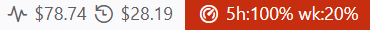
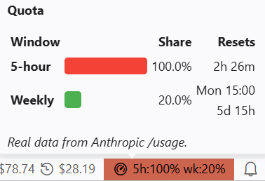
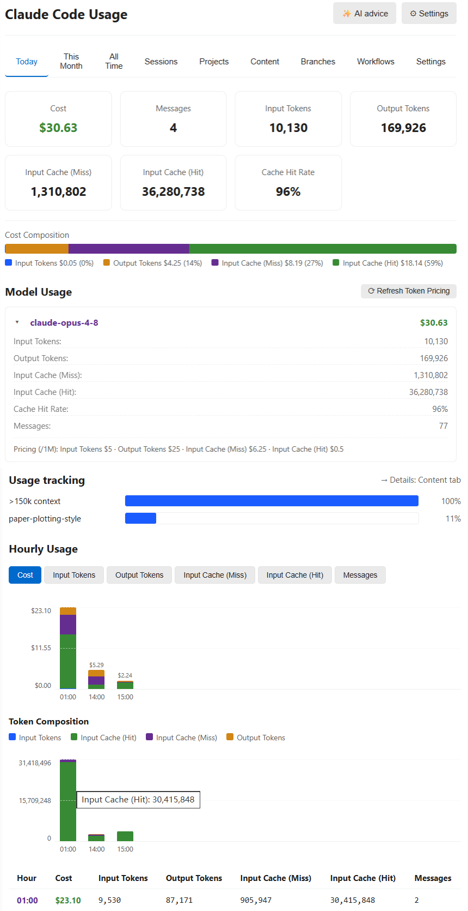

# Claude Code 使用量モニター

🌐 **言語**: [🏠 Main](README.md) | [English](README-en.md) | [繁體中文](README-zh-TW.md) | [简体中文](README-zh-CN.md) | **日本語** | [한국어](README-ko.md) | [Bahasa Indonesia](README-id.md)

---

**Claude Code と Codex のローカル使用量を改善するステータスバーコーチ。** 請求ツールではありません。Claude のコスト / クォータ表示を維持し、Codex Beta は Codex 固有のトークンと動作の意味で分析します。

> **これは何か**：ローカルの Claude Code 会話ログを読み取り、**トークンから算出した**使用量とコストの見積もりを表示する VS Code ステータスバーモニター。さらに、プロンプトの改善と無駄削減を提案する任意の AI アドバイザー付き。
>
> **これは何ではないか**：請求ツールではありません。表示される金額はすべて公開のトークン単価に基づく見積もりです。実際の請求は Anthropic アカウントをご確認ください。

> スクリーンショットは英語 UI のものです。全機能の詳細は[メイン README](README.md) を参照してください。

## スクリーンショット

### ステータスバー



クォータ表示にカーソルを合わせると内訳が出ます：



### ダッシュボード



## 主な機能

- **ステータスバー** — 本日のコスト、現在のセッションのコスト、そして Claude Code 自身の OAuth セッションから読み取る実際の 5 時間 / 週間クォータ（`5h:N% wk:N%`）。設定不要。
- **ダッシュボードタブ** — 今日 / 今月 / 全期間 に加え、**Sessions / Projects / Content / Branches**。すべて並べ替え可能。
- **積み上げコスト構成チャート**（Y 軸と参照線付き）— 各日 / 各月のコストが入力・出力・キャッシュ書き込み・キャッシュ読み取りにどれだけ使われたか一目で分かります。
- **Content タブ** — どの内容がトークンを消費しているか（あなたのプロンプト vs ツール結果 vs アシスタント出力 / 思考）を推定。
- **AI アドバイス**（任意）— 使用量サマリーと最近のプロンプトのサンプルを OpenAI 互換 API（デフォルト DeepSeek V4 Pro）に送り、具体的な書き換えを提案。キーは自分で用意、または静的デモを先にプレビュー可能。
- **マルチベンダー価格** — Opus 4.x / Sonnet 4.x / Haiku 4.5 は Anthropic 公式価格で検証済み。OpenAI / Gemini / DeepSeek / Kimi / GLM / Qwen の参考価格（ファミリー認識フォールバック付き）。`Refresh Token Pricing` で LiteLLM の最新価格を取得。
- **パーソナライズ** — 言語、タイムゾーン、小数点桁数、コンパクト数値、プロジェクトのグループ化、ダッシュボード自動更新の切り替え。

## v2.3 Codex Beta

- Codex の使用量レコードは `sessions/**/*.jsonl` と `archived_sessions/**/*.jsonl` からだけ検出し、認証情報、DB、未知のファイルは対象外です。これとは別に、`$CODEX_HOME/session_index.jsonl` だけをストリームで読み込み、実際のスレッド名に使う `id` → `thread_name` の対応を取得します。名前に含まれる絶対パスは伏せ、名前はメモリ内だけに保持します。使用量 JSONL の各行は、許可リスト内の使用量・構造メタデータを抽出するためだけにストリーム処理で一時解析します。プロンプト、応答、コマンド、ツール引数の各フィールドは参照も分析利用もせず、保持・永続化もしません。
- **処理済み** = 入力 + 出力、**非キャッシュ使用量** = 非キャッシュ入力 + 出力、**キャッシュ入力**は入力の部分集合、reasoning は出力の部分集合です。概要には「キャッシュ入力 / 入力」による入力キャッシュヒット率も表示します。Codex の請求コストは表示しません。先頭のサマリーカードには選択範囲の API 等価コスト推定を明示し、全期間ビューには同じ単価基準の週間推移を表示します。Claude / Codex / Compare は各プロバイダーの集計方法を分けて扱います。
- Codex の**今日**は、設定したタイムゾーンの現在の暦日です。正確な時間別 API 等価コストを表示し、Token 構成は独立したビューとして残します。日別・月別のメインチャートも API 等価コストを既定表示にし、Token 構成は別に確認できます。正確に一致する既知モデルだけを価格計算に含めるため、未知モデルは価格未設定のままで、価格カバレッジは常に表示されます。schema 3 と互換性のある追加型の時間別 sidecar は、今日の使用を含むことが既に分かっている canonical ファイルだけを対象とし、checkpoint 保存と再開に対応します。全履歴の再インデックスは発生させません。
- リクエスト単位の Token 帰属では、有効な `last_token_usage` の各 component を優先します。その `total_tokens` はアクティブなコンテキスト量であり、リクエスト使用量ではありません。total と last の完全な数値署名により、同じ仮名化 rate-limit ソースまたは直前の隣接レコードの再生を証明できる場合だけ除外します。last snapshot がない場合は cumulative lineage high-water にフォールバックします。アップグレード後はインデックスを一度自動再構築し、その間もインデックス済み小計を表示します。
- Claude と Codex の全期間 / 比較ビューは、ローカル Token ログから過去の使用済み等価値を直接計算します。最新の有効な公式リセット観測を基準に、一意で重複しない週間期間の列を作り、各使用イベントは一つの期間にだけ数えます。利用できる観測がなければ、使用分のみの履歴を UTC の月曜から月曜の暦週にフォールバックします。系列名が異なっていても、重複して整合しない将来リセットは競合として扱い、二つ目の「現在の期間」を作りません。期間範囲とリセット時刻は分けて表示します。Codex の使用量は日単位のスライスで保存されます。スライスが公式の日中リセットをまたぐ場合も Token は一度だけ数え、影響する期間を「境界近似」と表示し、使用済み等価値だけを示して総上限や未使用分を逆算しません。この表示規則はインデックス schema を変更せず、再構築も発生させません。Codex の過去期間は常に使用済み値だけを表示します。最新の現在期間に限り、リセット競合がなく、インデックス済み使用量を単一の観測元へ確実に帰属できる場合だけ総上限を推定でき、現在の未使用値は結論として示しません。帰属できない複数ログインの使用量も使用済み値だけとし、架空のアカウント分割は行いません。履歴には現在の公式 API 単価を一貫して適用します。これは請求額や公式のサブスクリプション価格ではなく代理推定です。このパネルは既定で有効で、設定の `showWeeklyEquivalentValue` から非表示にできます。Claude はこのリリースからプロファイル別に上限観測を記録します。
- Codex に切り替えても、既存の今日 / 今月 / 全期間 / セッション / プロジェクト / コンテンツ / 設定の構成を維持し、Codex の意味に合わせてラベルだけを調整します。両プロバイダーは同じ render function、HTML class、チャート、表、余白、レスポンシブルールを使います。時系列チャートの幅は揃い、密な内容だけが各領域内でスクロールします。Codex の提案はインデックス済み 30 日間の構造的根拠を使います。
- ルートタスクには、絶対パスを伏せた最新の実際のスレッド名を使います。子タスクは自身の実際のスレッド名を優先し、ない場合は報告されたニックネームを使って親 / ルートタスク名も表示します。それらもない場合はローカライズ済みの中立的な代替名を表示します。プロジェクト名は Git リポジトリ名、Git 外ではフォルダー名です。信頼できる集計ができない Branches や Workflows は作り上げません。
- 過去 7 日 / 30 日は、設定したタイムゾーンでイベント発生日を正確に区切ります。移行または再構築中は、Codex のカード、表、プロジェクト、セッション、提案、ステータス値を**インデックス済み小計**として明示し、未検証の旧集計値を除外します。Codex home を検出するとプロバイダータブを直ちに表示し、初回インデックス中はページ内に正確なインデックス済みファイル数、割合、容量の進捗をリアルタイム表示します。「比較」は両プロバイダーに実データが揃ってから表示します。最初のアトミックチェックポイント生成後は、インデックス処理が続いていても小計ダッシュボード全体を利用でき、進捗表示がカードや表に置き換わることはありません。選択した Codex home はアカウントを区別しないため、同じ home に複数のログインが残したログは合算されます。ローカルログには信頼できるアカウント識別子がないため、上限カードは**最終観測**のままで合算しません。
- 各提案は、インデックス済み 30 日間の構造集計に根拠がある場合だけ、観測、読みやすい根拠、条件付きアクションを示します。根拠がなければ一般論を生成しません。
- 永続インデックスには、マシン固有のソルトで仮名化したキー、数値・構造集計、ならびにサニタイズ済みのプロジェクト、ディレクトリ、エージェント、モデル、effort、役割、時刻、品質メタデータを保存します。生の ID、完全なパスやリポジトリ URL、スレッド名、会話本文は保存しません。
- 共通の Settings タブは、Codex 選択時に共通設定と Codex に有効な設定だけを表示します。Codex の収集とローカル Codex 提案は別々に無効化できます。バックグラウンド監視遅延は既定 30 秒で、Off や長い間隔も選べます。初回インデックスまたは未完了の旧インデックス移行には、上限 64 GiB / 16,384 ファイルパスのストリーミング処理を 1 回与えます。この容量をメモリに事前確保せず、キャンセルと再開にも対応します。収束後はバックグラウンド処理が 128 MiB / 64 ファイルパスに戻り、常時表示される「更新」は 2 GiB / 512 ファイルパスを使います。変更のない通常更新は使用量 JSONL 本文を読みません。

## インストール

拡張機能ビュー（`Ctrl+Shift+X`）で **`Claude Code Usage`** を検索するか：

```
ext install GrowthJack.claude-code-usage
```

Cursor / Windsurf 向けに [Open VSX Registry](https://open-vsx.org/extension/GrowthJack/claude-code-usage) でも公開しています。

## 設定

設定（`Ctrl+,`）を開き **`Claude Code Usage`** を検索。すべて任意です。よく使うもの：

- `language` — UI 言語（`auto` / `en` / `de-DE` / `zh-TW` / `zh-CN` / `ja` / `ko` / `pt-BR` / `id`）。
- `timezone` — 日付表示用の IANA タイムゾーン（例 `Asia/Tokyo`）。
- `usageLimitTracking` — 実際の 5 時間 / 週間クォータ表示。
- `showCost` / `showContext` — ステータスバーのコスト表示と、コンテキストウィンドウ使用率（`/context` 風）の切り替え。
- これらのステータスバー項目は個別に非表示にできます。`usageLimitTracking` / `showCost` / `showContext` を `false` にすると、その項目だけ消えます。
- `advice.apiKey` — AI アドバイス機能の API キー（OpenAI 互換）。
- `pauseDashboardRefresh` — ダッシュボードの自動更新を一時停止（ダッシュボードのヘッダーでも切り替え可能）。

設定の全一覧は[メイン README](README.md#configuration) を参照。

## トラブルシューティング

**「No Claude Code Data」** — Claude Code がインストールされ、少なくとも一度使用されていることを確認。`dataDirectory` 設定を確認（自動検出は `~/.claude/projects` を参照）。

**クォータが `5h:--% wk:--%`** — 現在の Claude プロファイルにログインして
ください。認証情報は明示的な `dataDirectory`、最初の有効な
`CLAUDE_CONFIG_DIR`、`~/.claude` の順で選ばれます。グローバルな macOS
Keychain 項目はデフォルトプロファイルにのみ使用されます。

**古い月の履歴がない** — Claude Code は `cleanupPeriodDays`（デフォルト 30 日）より古いログを削除します。保持期間を延ばすには `~/.claude/settings.json` に `{ "cleanupPeriodDays": 365 }` を設定。削除済みのログは復元できません。

**トークン数が Claude Code の `stats-cache` より少ない** — 1 回の応答が、
同じ `messageId`、`requestId`、完全な `usage` ベクトルを持つ別々の
`thinking` 行と `text` 行として転録されることがあります。本拡張機能は
応答 ID ごとに最大ベクトルを 1 回だけ数えますが、Claude Code の
`stats-cache` は行ごとに加算します。キャッシュ値に合わせる倍率補正は行いません。

**トークン数がプロバイダーのダッシュボードより少ない** — 一部のプロキシ / 動的ワークフローはエージェントごとの記録をサブディレクトリに書き込み、不完全な場合があります。実際の消費はプロバイダーの請求ページをご確認ください。ネイティブのワークフロー帰属は計画中です。

**履歴が大きい環境で CPU 使用率が高い／更新が遅い（Linux を含む）**
- V2.2.1 では active 時に隠れて 8 秒へ短縮されるポーリングを廃止し、最初の
  timestamp 読み取りを制限します。導入前は **Live refresh delay** を **Off**、
  **Refresh interval** を **300–900 秒**にし、必要なら **Content analysis** も
  Off にしてください。Dashboard auto-refresh だけを Off にしても、ステータス
  バー用の解析は止まりません。
- V2.2.1 でも高負荷が続く場合は **Show Diagnostic Logs** の匿名 `refresh:` 行だけを
  issue #70 に添付してください。prompt、path、session ID、credential、raw log は含みません。

## クレジット

[`ClaudeCodeUsage/ClaudeCodeUsage`](https://github.com/ClaudeCodeUsage/ClaudeCodeUsage) からフォーク。MIT ライセンス。コミュニティの貢献は [CHANGELOG.md](CHANGELOG.md) に記載。多くのコード変更は [Claude Code](https://claude.com/claude-code) の支援で作成されました。

開発ツールのクレジット：リポジトリの保守には [Claude Code](https://claude.com/claude-code) と [OpenAI Codex](https://developers.openai.com/codex/) の両方を使用しています。これは人間のコントリビューターとは別のツール表記であり、Codex を Release Drafter のコントリビューター一覧に加えたり、架空の `Co-Authored-By` ID を付けたりしません。

**Issue・PR・アイデアを歓迎します** —— それがプロジェクトの成長につながります。

## ライセンス

[MIT](LICENSE)
