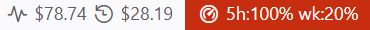
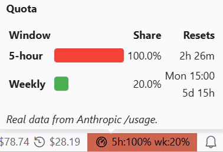
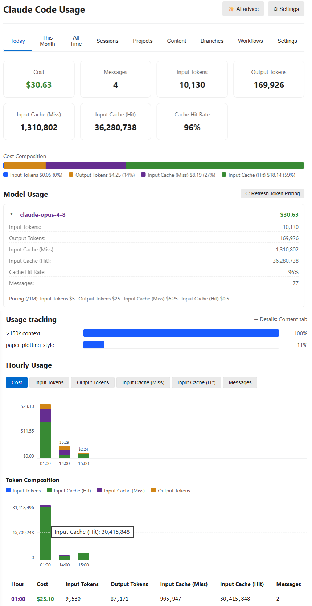
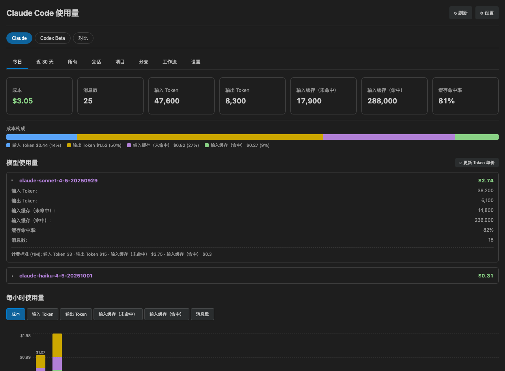
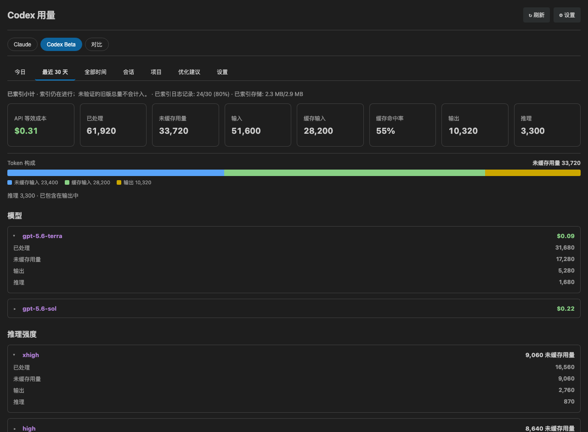
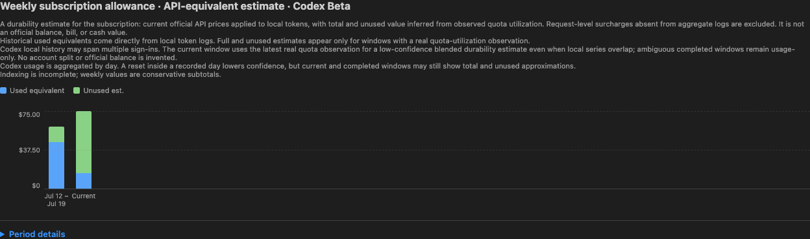
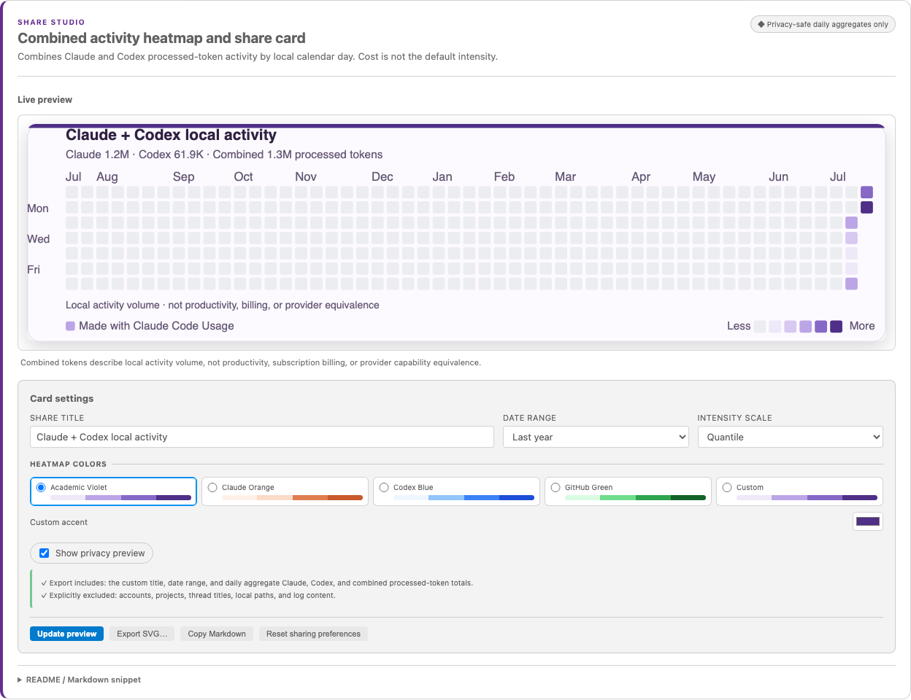
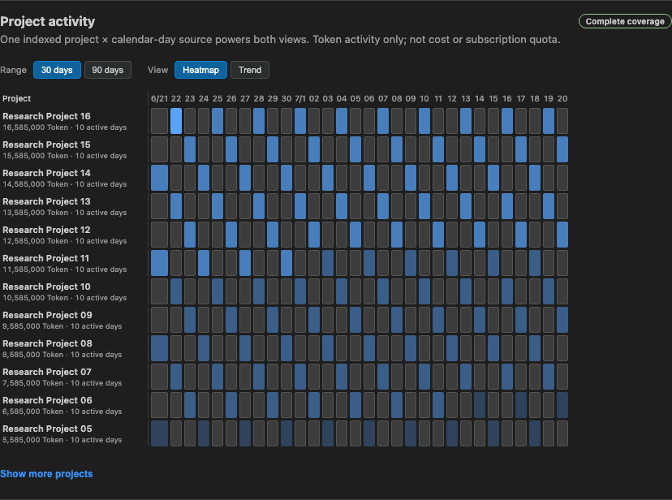

# Claude Code 사용량 모니터

🌐 **언어**: [🏠 Main](README.md) | [English](README-en.md) | [Deutsch](README-de-DE.md) | [繁體中文](README-zh-TW.md) | [简体中文](README-zh-CN.md) | [日本語](README-ja.md) | **한국어** | [Português (Brasil)](README-pt-BR.md) | [Bahasa Indonesia](README-id.md)

---

**Claude Code와 Codex의 로컬 사용량을 개선하는 상태 표시줄 코치.** 청구 도구가 아닙니다. Claude 비용 / 쿼터 보기를 유지하면서 Codex는 Codex 고유의 토큰과 동작 의미로 분석합니다.

> **무엇인가**: 로컬 Claude Code와 Codex 사용 로그를 읽고 각 공급자의 의미에 맞게 토큰, 한도, 추정치를 보여주는 VS Code 상태 표시줄 모니터입니다. 불필요한 사용을 줄이는 선택적 조언도 제공합니다.
>
> **무엇이 아닌가**: 청구 도구가 아닙니다. Claude 비용과 Codex의 API 환산 비용은 추정치이며 구독 청구액이 아닙니다. 실제 청구는 해당 공급자 계정에서 확인하세요. Codex 한도는 로컬에서 마지막으로 관측한 값이며 실시간 잔액이 아닙니다.

> 스크린샷에는 영어와 중국어 간체 UI가 포함됩니다. 전체 기능 설명은 [메인 README](README.md)를 참고하세요.

## 스크린샷

### 상태 표시줄



쿼터 표시기에 마우스를 올리면 상세 내역이 나옵니다:



### 대시보드



### v2.3 Codex 및 비교











위 5장은 실제 대시보드 렌더러, 합성 데이터, VS Code Light+/Dark+ 테마 변수로 생성했습니다. 개인 사용량이나 청구 증거가 아니며, 네이티브 VSIX 설치는 별도로 검증합니다.

- Codex는 **오늘 사용한 토큰**과 **남은 쿼터**를 따로 표시합니다. 주간 사용률 36%이면 `wk 64%`입니다. 툴팁에는 사용률 막대, 초기화 시각, 줄바꿈 설명이 유지됩니다. 쿼터는 마지막 로컬 관측이며 실시간 잔액이 아닙니다.
- 기간 상세는 기본으로 접고 공유 설정은 미리보기 아래에 둡니다. 공유는 기본 활성화이며 끌 수 있고, 색 강도는 분위수·로그·선형 중 선택합니다.
- CLI 호출은 usage가 있는 영구 세션 로그를 남겨야 집계됩니다. 저장하지 않은 호출은 복원할 수 없습니다. 오늘과 최근 30일은 설정된 시간대를 사용합니다.
- Projects에 두 공급자 공통의 Token 전용 30/90일 ‘프로젝트 × 날짜’ 히트맵과 일별 누적 추세를 추가했습니다. 정확한 툴팁, 적용 범위, 제한된 행 수, ‘기타 프로젝트’ 꼬리를 유지합니다.

## 기능

- **상태 표시줄** — 오늘 비용, 현재 세션 비용, 그리고 Claude Code 자체 OAuth 세션에서 읽는 실제 5시간 / 주간 쿼터(`5h:N% wk:N%`). 설정 불필요.
- **쿼터 표시 형식** — ⚙ 설정에서 기본(기본값), 5시간만, 주간만 선택할 수 있습니다. 사용자 지정을 선택할 때만 템플릿 입력칸이 표시됩니다.
- **대시보드 탭** — 오늘 / 최근 30일 / 전체 기간, 그리고 **Sessions / Projects / Content / Branches**. 모두 정렬 가능.
- **누적 비용 구성 차트**(Y축과 기준선 포함) — 각 일 / 월의 비용 중 입력·출력·캐시 쓰기·캐시 읽기가 차지하는 비율을 한눈에.
- **Content 탭** — 어떤 콘텐츠가 토큰을 소비하는지 추정(내 프롬프트 vs 도구 결과 vs 어시스턴트 출력 / 사고).
- **AI 조언**(선택) — 먼저 로컬 근거와 설명 가능한 행동을 보여 줍니다. 선택형 BYOK 개인화는 기본적으로 집계만 포함하고 프롬프트 샘플에는 별도 동의가 필요합니다. 전체 요청을 정확히 미리 본 뒤 별도의 보내기 동작을 수행하며, 유용함 / 유용하지 않음 / 적용됨 피드백은 로컬에만 남습니다. 조언은 제한된 기간 동안 일시 중지할 수 있으며 만료되거나 수동으로 다시 표시됩니다.
  동의를 철회하면 미리보기가 즉시 무효화되고 진행 중인 조언 요청이 취소됩니다. 이미 전송된 데이터는 회수할 수 없습니다.
- **멀티 벤더 가격** — Opus 4.x / Sonnet 4.x / Haiku 4.5는 Anthropic 공식 가격으로 검증. OpenAI / Gemini / DeepSeek / Kimi / GLM / Qwen 참고 가격(패밀리 인식 폴백 포함). `Refresh Token Pricing`으로 LiteLLM 최신 가격 가져오기.
- **개인화** — 언어, 시간대, 소수 자릿수, 간략 숫자, 프로젝트 그룹화, 대시보드 자동 새로고침 토글.

## v2.4 새로운 기능

<details open>
<summary>최신 릴리스의 주요 변경 사항</summary>

- **갱신과 복구 상태 개선** — 자동 갱신 일시정지는 두 페이지에 적용되며 백그라운드 집계와
  상태 표시줄은 계속 동작합니다. 실패 시 검증된 데이터를 유지하고 보완 처리와 재시도 대기를
  구분합니다. 변경 없는 숨겨진 패널은 제한된 캐시를 재사용합니다.
- **정확한 미리보기와 안전한 설정** — AI 요청의 주소·형식·모델을 표시하고 공급자를
  임의로 바꾸지 않습니다. 공유 카드는 확인된 SVG를 내보내며 설정 변경 후 재확인이 필요합니다.
  기본값 복원은 API 키를 유지하고 Codex 디렉터리는 두 설정 페이지에서 수정할 수 있습니다.
- **가격 진단 상한** — 알 수 없는 모델 경고는 확장 호스트 실행별로 중복을 제거하고
  총수를 제한하여 [#122](https://github.com/ClaudeCodeUsage/ClaudeCodeUsage/issues/122)의
  경고 폭증을 방지합니다. 이미 만료된 분석 파일은
  빈 기여를 유지해 증분 갱신을 방해하지 않습니다.
- **새 모델과 갱신 보호** — Opus 5.5, Sonnet 5.5, GPT-6.1 Sol, GPT-6 Sol, GPT-6 Luna의
  표준·캐시 가격을 각각 적용했습니다. 잘못된 모델 정보로 전체 색인이 실패하지 않으며 집계는
  갱신마다 한 번만 복사합니다. 백그라운드 결과와 가격 갱신에는 용량 제한이 있고,
  알 수 없는 Codex 모델에는 추정 가격을 적용하지 않습니다.
- **대규모 기록 갱신** — 변경 없는 콘텐츠 귀속은 캐시를 사용하고 AI 컨트롤은 최신 상태를
  유지합니다. 표시 설정은 완료된 색인 작업을 재사용하며 늦게 도착한 색인 결과가 갱신된
  가격을 덮어쓰지 못합니다.
  오늘의 사용량 귀속은 달력 날짜별로 캐시하여, 변경 없는 분 단위 갱신에서 전체 기록을
  다시 탐색하지 않고 같은 시간대의 카운트다운을 갱신합니다. 매시간 숨겨진 패널을
  갱신할 때는 콘텐츠 귀속을 한 번 다시 계산합니다.
- **업그레이드 호환 보호** — 변경 없는 갱신은 승인된 미리보기를 유지하며 Claude 디렉터리를
  바꾸면 갱신 일시 중지 중에도 이전 데이터를 지웁니다. 기존 키에 명시적 형식이 없으면 이전
  Anthropic 형식을 유지합니다. 불일치 시 설정에서 API 형식과 URL을 직접 선택하고 다시 미리보세요.
  새 설치는 OpenAI 호환 기본값을 쓰지만 기존 키를 다른 호스트로 자동 전송하지 않습니다.
- **Codex 상태와 스크롤** — 간결한 기본 지표는 오늘 처리한 토큰이며 주간 한도는
  남은 비율을 표시합니다. 스크롤 중 패널 갱신은 잠시 미루되 대기 시간에 상한을 둡니다.
- **하나의 미리보기 우선 공유 작업 공간** — 전체 너비 내보내기 미리보기를 중심에 두고
  컨트롤은 아래에 배치했습니다. 하나의 표시 형식 선택기로 **통합 활동 히트맵**,
  **Claude 공유 카드**, **Claude 토큰 히트맵**을 전환합니다. 통합 표시는 두 공급자 모두 실제 데이터가
  있을 때만 사용할 수 있으며, 기존 두 표시는 계속 Claude 전용입니다.
- **중복 패널 없는 호환 진입점** — `exportShareCard`, `exportHeatmap`,
  `publishHeatmapToGitHub`는 유지되며 해당 미리보기를 엽니다. `enableShareCard`는 기본 켜짐인
  유일한 표시 스위치입니다. 폐기된 `showHeatmap`은 한 릴리스 동안 상태 호환성과 제한된 삭제를 위해서만 유지됩니다.
- **엄격한 로컬 산출물 및 공급자 경계** — 표시 선택, 미리보기, 로컬 SVG/Markdown
  내보내기는 이미 집계된 데이터만 사용하며 네트워크 요청, GitHub 로그인 또는 프로필/아바타/이름
  조회를 수행하지 않습니다. 연결할 수 있는 것은 Claude 히트맵의 별도 **GitHub에 게시** 작업뿐입니다.
  이 작업은 공개 저장소로 제한되며 쓰기 전에 정확한 대상과 생성/덮어쓰기 작업을 확인합니다.
  통합 활동은 청구, 생산성, 능력 또는 공급자 간 동등성을 뜻하지 않습니다.

</details>

## v2.3 새로운 기능

<details>
<summary>v2.3 Codex·비교·기록 기능 보기</summary>


- **v2.3 계열 전반의 개선** — GPT-6 Astra와 Fable 5.1 모델 메타데이터,
  선택형 AWS Bedrock 가격, 고정 기준 환율 표시 통화 선택, Token 전용 30/90일
  프로젝트 활동 매트릭스, 월/일/시간 전체 드릴다운, 상태를 보존하는 새로 고침, 접근성 차트, watcher 및 제목 인덱스
  부하 절감을 추가했습니다. 패치별 상세 내용은 CHANGELOG와 GitHub Releases에만
  유지합니다.
- Codex 사용량 레코드는 `sessions/**/*.jsonl`과 `archived_sessions/**/*.jsonl`에서만 찾으며 자격 증명, DB, 알 수 없는 파일은 제외합니다. 별도로 `$CODEX_HOME/session_index.jsonl` 하나만 정확히 스트리밍해 실제 스레드 제목에 사용할 `id` → `thread_name` 매핑을 가져옵니다. 제목 속 절대 경로는 가리고 제목은 메모리에만 유지합니다. 사용량 JSONL 각 줄은 허용 목록의 사용량·구조 메타데이터를 추출하기 위해서만 스트리밍 방식으로 일시 파싱합니다. 프롬프트, 응답, 명령, 도구 인수 필드는 검사하거나 분석에 사용하지 않으며 보관·영구 저장하지 않습니다.
- **처리된** 값 = 입력 + 출력, **캐시되지 않은 사용량** = 캐시되지 않은 입력 + 출력, **캐시 입력**은 입력의 부분집합, reasoning은 출력의 부분집합입니다. 개요에는 캐시 입력 / 입력으로 계산한 입력 캐시 적중률도 표시합니다. Codex 청구 비용은 표시하지 않습니다. 첫 요약 카드에는 선택 범위의 API 등가 비용 추정치를 명확히 표시하고, 전체 기간 보기에는 같은 가격 기준의 주간 추이를 표시합니다. Claude / Codex / Compare는 공급자별 집계 의미를 분리합니다.
- Codex의 **오늘**은 설정한 시간대의 현재 달력 날짜를 뜻합니다. 정확한 시간별 API 등가 비용을 표시하고 Token 구성은 별도 보기로 유지합니다. 일별·월별 기본 차트도 API 등가 비용을 기본값으로 사용하며 Token 구성은 따로 볼 수 있습니다. 정확히 일치하는 알려진 모델만 가격 계산에 포함하므로 알 수 없는 모델은 가격을 매기지 않고 가격 적용 범위는 계속 표시합니다. schema 3과 호환되는 추가형 시간별 sidecar는 최근 30일의 희소한 날짜 / 시간 버킷을 보관하고 checkpoint 저장과 재개, 31일째 제거를 지원하며 날짜를 펼칠 때 JSONL을 읽지 않습니다. Codex 월별 차트와 표는 오래된 달부터 표시합니다.
- 요청 단위 Token 귀속은 유효한 `last_token_usage` component를 우선 사용합니다. 그 안의 `total_tokens`는 활성 컨텍스트 크기이며 요청 사용량이 아닙니다. total과 last의 전체 숫자 서명이 동일한 가명 rate-limit 소스 또는 바로 인접한 레코드의 재생을 증명할 때만 중복을 제거합니다. last snapshot이 없으면 cumulative lineage high-water로 되돌아갑니다. 업그레이드 후 인덱스를 한 번 자동 재구축하며 그동안에도 인덱싱된 소계를 계속 표시합니다.
- Claude와 Codex의 전체 기간 / 비교 보기는 로컬 Token 로그에서 과거 사용 등가치를 직접 계산합니다. 가장 최근의 유효한 공식 재설정 관측을 기준으로 고유하고 겹치지 않는 주간 기간열을 만들며 각 사용 이벤트는 한 기간에만 집계됩니다. 사용할 수 있는 관측이 없으면 사용분 전용 기록만 UTC 월요일부터 월요일까지의 달력 주로 되돌아갑니다. 같은 quota series의 관측은 하나의 series로 유지하고 낮은 신뢰도의 근사치로 표시할 수 있으며 두 번째 「현재 기간」을 만들지 않습니다. Codex의 account-wide `codex` 관측은 과거와 현재 기간 모두를 장식할 수 있고 재설정 이동, 파일 출처 또는 일별 경계 통과는 신뢰도를 낮춥니다. 파일 키는 계정 ID가 아니므로 같은 home의 대상 파일을 함께 사용합니다. 로컬 quota series가 겹쳐도 현재 기간은 마지막 실제 관측으로 신뢰도 낮은 혼합 추정을 표시합니다. 귀속이 모호한 완료 기간이나 관측이 없는 기간은 사용된 등가치만 표시하고 계정 분리를 만들어 내지 않습니다. 내부적으로 일관된 관측 기간은 현재 기간을 포함해 총한도와 미사용 내구성 추정치를 표시할 수 있으며, 귀속이나 경계가 불확실하면 값을 숨기지 않고 신뢰도를 낮춥니다. 이 표시 규칙은 인덱스 schema를 변경하거나 재구축을 유발하지 않습니다. 현재 공식 API 단가를 전체 기록에 일관되게 적용합니다. 이는 청구액, 공식 잔액 또는 공식 구독 가격이 아닌 대리 추정치입니다. 이 패널은 기본으로 켜지며 설정의 `showWeeklyEquivalentValue`에서 끌 수 있습니다. Claude는 이 릴리스부터 프로필별 한도 관측을 기록합니다.
- Codex로 전환해도 기존 오늘 / 최근 30일 / 전체 기간 / 세션 / 프로젝트 / 콘텐츠 / 설정 구조를 유지하고 Codex 의미에 맞게 레이블만 조정합니다. 두 공급자는 같은 render function, HTML class, 차트, 표, 간격 및 반응형 규칙을 사용합니다. 시계열 차트는 너비가 정렬되고 밀집된 콘텐츠만 각 영역 안에서 스크롤됩니다. Codex 제안은 인덱싱된 30일 구조 근거를 사용합니다.
- 루트 작업은 절대 경로를 가린 최신 실제 스레드 제목을 사용합니다. 자식 작업은 자신의 실제 스레드 제목을 우선 사용하고, 제목이 없으면 보고된 닉네임을 사용하면서 부모 / 루트 작업 제목도 표시합니다. 이 정보도 없으면 현지화된 중립 대체 이름을 표시합니다. 프로젝트 이름은 Git 저장소 이름을, Git 외부에서는 폴더 이름을 사용합니다. 안정적으로 집계할 수 없는 Branches나 Workflows를 만들어 내지 않습니다.
- 최근 7일 / 30일 값은 설정한 시간대에서 이벤트 발생일을 정확히 나눠 계산합니다. 마이그레이션이나 재구축이 진행 중이면 Codex 카드, 표, 프로젝트, 세션, 권장 사항 및 상태 값을 **인덱싱된 소계**로 명시하고 검증되지 않은 이전 합계를 제외합니다. Codex home이 감지되면 공급자 탭을 즉시 표시하고, 최초 인덱싱 중에는 페이지 안에 정확한 인덱싱 파일 수, 백분율, 용량 진행 상황을 실시간으로 표시합니다. 비교 탭은 두 공급자 모두 실제 데이터가 생긴 뒤에만 표시됩니다. 첫 원자적 체크포인트가 생성되면 인덱싱이 계속되는 동안에도 전체 소계 대시보드를 사용할 수 있으며 진행 표시가 카드나 표를 대체하지 않습니다. 선택한 Codex home은 계정을 구분하지 않으므로 같은 home에 여러 로그인이 남긴 로그는 합산됩니다. 로컬 로그에는 신뢰할 수 있는 계정 식별자가 없으므로 한도 카드는 **마지막 관측**만 유지하며 합산하지 않습니다.
- 각 제안은 인덱싱된 30일 구조 집계에 근거가 있을 때만 관측, 읽기 쉬운 근거, 조건부 행동을 보여 줍니다. 근거가 없으면 일반적인 조언을 생성하지 않습니다.
- 영구 인덱스에는 기기별 솔트로 가명화한 키, 수치·구조 집계, 그리고 정제된 프로젝트, 디렉터리, 에이전트, 모델, effort, 역할, 시간, 품질 메타데이터를 저장합니다. 원시 ID, 전체 경로나 저장소 URL, 스레드 제목, 대화 본문은 저장하지 않습니다.
- 공용 Settings 탭은 Codex 선택 시 공통 설정과 Codex에 유효한 설정만 표시합니다. Codex 수집과 로컬 Codex 제안은 각각 끌 수 있습니다. 백그라운드 감시 지연은 기본 30초이며 Off 또는 더 긴 간격도 선택할 수 있습니다. 최초 인덱스 또는 완료되지 않은 이전 인덱스 마이그레이션에는 한 번의 제한된 64 GiB / 16,384 파일 패스 스트리밍 상한을 적용합니다. 이 용량만큼 메모리를 미리 할당하지 않으며 취소와 재개를 지원합니다. 수렴 후 백그라운드 작업은 128 MiB / 64 파일 패스로 돌아가고, 항상 보이는 새로 고침은 2 GiB / 512 파일 패스를 사용합니다. 변경 없는 일반 새로 고침은 사용량 JSONL 본문을 읽지 않습니다.

</details>

## 설치

확장 보기(`Ctrl+Shift+X`)에서 **`Claude Code Usage`**를 검색하거나:

```
ext install GrowthJack.claude-code-usage
```

Cursor / Windsurf용으로 [Open VSX Registry](https://open-vsx.org/extension/GrowthJack/claude-code-usage)에도 게시되어 있습니다.

## 설정

설정(`Ctrl+,`)을 열고 **`Claude Code Usage`**를 검색하세요. 모두 선택 사항입니다. 가장 유용한 것:

- `language` — UI 언어(`auto` / `en` / `de-DE` / `zh-TW` / `zh-CN` / `ja` / `ko` / `pt-BR` / `id`).
- `timezone` — 날짜 표시용 IANA 시간대(예: `Asia/Seoul`).
- `usageLimitTracking` — 실제 5시간 / 주간 쿼터 표시.
- `showCost` / `showContext` — 상태 표시줄의 비용 항목과 컨텍스트 윈도우 사용률(`/context` 유사) 표시 전환.
- 위 상태 표시줄 항목들은 개별적으로 끌 수 있습니다. `usageLimitTracking` / `showCost` / `showContext` 를 `false`로 설정하면 해당 항목만 숨겨집니다.
- `advice.apiKey` — AI 조언과 Usage Optimizer가 함께 쓰는 사용자 제공 API 키(Anthropic 또는 OpenAI 호환 엔드포인트).
- `pauseDashboardRefresh` — 대시보드 자동 새로고침 일시정지(대시보드 헤더에서도 토글 가능).

전체 설정 표는 [메인 README](README.md#configuration)를 참고하세요.

## 로컬 데이터, 개인정보 및 제한

전체 목록, 보존, 마이그레이션, 삭제 및 원격 경계는
[Local data and privacy](LOCAL-DATA.md)([中文](LOCAL-DATA.zh-CN.md))를 참고하세요.

| 데이터 | 로컬 보존 | 원격 동작 |
|---|---|---|
| 원본 로그 | 공급자 소유·읽기 전용, 전체 복사 안 함 | 기본 없음 |
| Codex 인덱스 | 제한된 가명 수치/구조 집계 | 없음 |
| 쿼터 기록 | 제한된 익명 창 관측, 원시 계정 ID 없음 | 활성화된 Claude 쿼터 조회만. Codex는 로컬 |
| UI/공유 | 필터와 선택형 제목/범위/GitHub 대상 문자열 | 정확한 확인 후에만 게시 |
| 조언/키 | 제한된 집계 근거, 키는 SecretStorage만 | 별도 보내기 후 정확히 미리 본 요청만 전송 |

구조화 근거에 없는 재설정은 복원할 수 없습니다. 여러 로그인 귀속이 모호하면 현재 기간은 마지막 실제 관측으로 신뢰도 낮은 혼합 추정을 표시하고, 완료 기간은 사용분만 표시합니다.
API 등가 값은 청구액이 아닙니다. 원본 로그 보존은 Claude Code/Codex가 관리하며 파생 상태는 명시적 삭제가 가장 확실합니다.

## 문제 해결

**"No Claude Code Data"** — Claude Code가 설치되어 최소 한 번 사용되었는지 확인하고, `dataDirectory` 설정을 확인하세요(자동 감지는 `~/.claude/projects`를 봅니다).

**쿼터가 `5h:--% wk:--%`로 표시** — 현재 Claude 프로필에 로그인하세요.
자격 증명은 명시적 `dataDirectory`, 첫 번째 유효한 `CLAUDE_CONFIG_DIR`,
`~/.claude` 순서로 선택됩니다. 전역 macOS Keychain 항목은 기본 프로필에만
사용됩니다.

**이전 달 기록 누락** — Claude Code는 `cleanupPeriodDays`(기본 30일)보다 오래된 로그를 삭제합니다. 더 오래 보관하려면 `~/.claude/settings.json`에 `{ "cleanupPeriodDays": 365 }`를 설정하세요. 이미 삭제된 로그는 복구할 수 없습니다.

**토큰 수가 Claude Code의 `stats-cache`보다 적음** — 한 응답이 동일한
`messageId`, `requestId`, 전체 `usage` 벡터를 가진 별도의 `thinking` 행과
`text` 행으로 기록될 수 있습니다. 확장은 응답 ID별로 가장 큰 벡터를 한 번만
계산하지만 Claude Code의 `stats-cache`는 행별로 더합니다. 캐시 값에 맞추기
위한 배율 보정은 적용하지 않습니다.

**토큰 수가 프로바이더 대시보드보다 적음** — 일부 프록시 / 동적 워크플로는 에이전트별 기록을 하위 디렉터리에 쓰며 불완전할 수 있습니다. 실제 지출은 프로바이더 청구 페이지를 확인하세요. 네이티브 워크플로 귀속 기능은 계획 중입니다.

**큰 기록에서 CPU 사용률이 높거나 새로 고침이 느림(Linux 포함)**
- V2.2.1은 active 상태에서 숨겨진 8초 폴링 강제를 제거하고 첫 timestamp 읽기를
  제한합니다. 설치 전에는 **Live refresh delay**를 **Off**, **Refresh interval**을
  **300–900초**로 설정하고 필요하면 **Content analysis**도 끄세요. Dashboard
  auto-refresh만 끄면 상태 표시줄용 로그 파싱은 계속됩니다.
- V2.2.1에서도 높은 사용률이 계속되면 **Show Diagnostic Logs**의 익명 `refresh:`
  줄만 issue #70에 첨부하세요. prompt, path, session ID, credential, raw log는 포함되지 않습니다.

## 크레딧

PR 작성자와 issue 제보자의 전체 목록은 [메인 README의 Credits](README.md#credits)에 있습니다. 병합된 변경과 병합되지 않은 제안은 구분합니다.

[@jack21](https://github.com/jack21)이 만들고 [@Carl723000](https://github.com/Carl723000)이 유지 관리합니다. MIT 라이선스입니다.

개발 도구 크레딧: 저장소 유지보수에는 [Claude Code](https://claude.com/claude-code)와 [OpenAI Codex](https://developers.openai.com/codex/)를 함께 사용합니다. 이는 사람 기여자와 분리된 도구 표기이며, Codex를 Release Drafter의 사람 기여자 목록에 넣거나 허위 `Co-Authored-By` 신원을 부여하지 않습니다.

**이슈, PR, 아이디어를 환영합니다** —— 그것이 프로젝트가 성장하는 방식입니다.

## 라이선스

[MIT](LICENSE)
