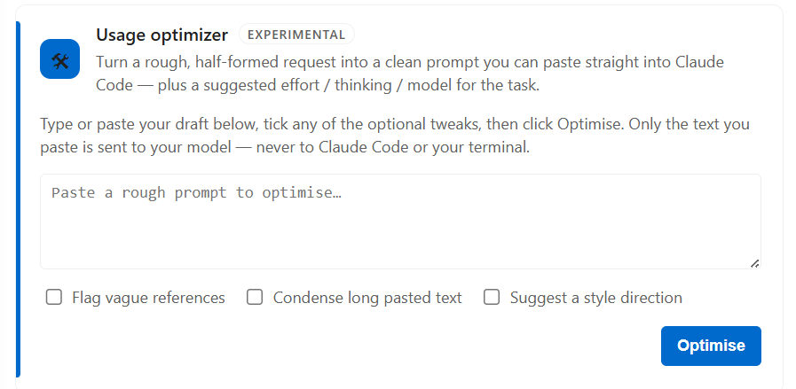

# Claude Code 使用量监控

🌐 **语言**: [🏠 Main](README.md) | [English](README-en.md) | [繁體中文](README-zh-TW.md) | **简体中文** | [日本語](README-ja.md) | [한국어](README-ko.md) | [Bahasa Indonesia](README-id.md)

---

**状态栏中的 Claude Code 与 Codex 本地用量教练。** 它不是账单工具。Claude 保留成本与配额视图；Codex Beta 按自己的 token 与行为语义提供分析，无需硬套 Claude 的结构。

> **它是什么**：一个 VS Code 状态栏小工具，读取本地 Claude Code 对话日志，用 token 数量乘以公开单价来估算使用量和成本；并可提供 AI 建议，帮你优化提示、减少浪费。
>
> **它不是什么**：账单工具。所有金额均为估算值（基于公开的每百万 token 单价），实际费用请以 Anthropic 官方账单为准。

> 截图取自英文界面。

---

## 截图

### 状态栏


*今日成本 · 当前 session 成本 · 5 小时和每周配额利用率。*

将鼠标移到配额指示器上查看明细：


*来自真实 `/usage` 数据：利用率百分比，以及每个窗口的剩余时间与重置时刻。*
*你的方案计量的每一项每周上限都会各占一行，按模型划分的上限也在其中（名称由 Anthropic 提供，因此该行会跟随实际受限的模型）；若你启用了使用额度，也会一并显示。*

### 仪表板


*点击状态栏打开完整仪表板：堆叠 token 构成图、小时分布、缓存命中率、按 token 类型的成本构成，以及下方的按模型 / 按日表格。*

### Content 标签页：看清 token 究竟花在了哪里


*估算各类内容的 token 占比：你的提示词 vs 工具结果（按工具）vs 助手输出 / 思考。这是优化使用的切入点，范围为最近 30 天（`advice.promptWindowDays`）。*

### AI 建议：基于你真实用量的一份教练报告

AI 建议生成的是一份 **Markdown 文档**，用文字展示比截图更直观。配好 key（`advice.apiKey`），点击 **Get AI advice**（✨ 按钮，或 Content 标签页那张卡），选一个范围（全部项目，或某个项目），它会把你的用量汇总加上一份**你自己的**提示词样本发给你的模型，打开一份按优先级排好的报告。自备 key，默认使用 Anthropic（`/v1/messages`），也支持任意 OpenAI 兼容端点。

返回内容大致是这样（示意）：

> **把指令写得更完整**
> - 有几条提示词只写了「修一下这个 bug」，没说是哪个文件、什么现象，于是第一轮要先去找。开头先点明文件 + 期望行为 vs 实际行为。
>
> **在不牺牲清晰度的地方省 token**
> - 约 38% 的 token 花在 150k 上下文以上。不相关的任务之间用 `/clear`，每次请求都更省。

### 用量优化器



粘贴进一条粗略、没成形的需求，获得一条干净、**可直接粘贴**的提示词（纯文本、无 Markdown），并附上推荐的 effort / thinking / 模型（以小标签显示）。三个可选开关进一步微调（标出含糊指代 · 压缩长粘贴内容 · 建议风格方向）。实验性，默认关闭；**只发送你粘贴的文字**，不碰你的文件、不进终端，且首次有一次性同意确认。

---

## 2.3 Codex Beta

- Codex 用量记录只会从 `sessions/**/*.jsonl` 与 `archived_sessions/**/*.jsonl` 中发现；凭据、数据库和未知文件仍明确排除。此外，插件会精确流式读取 `$CODEX_HOME/session_index.jsonl`，仅将 `id` 映射为 `thread_name`，用于真实线程标题。标题中的绝对路径会先脱敏，标题只保留在内存。用量 JSONL 会逐行流式、临时解析，以提取白名单内的用量与结构元数据；提示词、回复、命令和工具参数字段不会被检查或用于分析，也不会被保留或持久化。
- **已处理** = 输入 + 输出；**未缓存用量** = 未缓存输入 + 输出；**缓存输入**仍是输入的子集，reasoning 仍是输出的子集。概览还会按「缓存输入 / 输入」显示输入缓存命中率。Codex 不显示账单成本；首张汇总卡会针对当前范围显示明确标注的 API 等效成本估算，「全部时间」则按同一定价口径展示每周趋势。Claude / Codex / Compare 仍保持各供应商口径独立。
- Codex 的**今天**指配置时区中的当前自然日。页面会显示精确的小时 API 等效成本，并把 Token 构成作为独立视图；每日与每月主图也默认显示 API 等效成本，Token 构成仍单独保留。只有精确匹配的已知模型才参与计价，未知模型保持未定价，定价覆盖率始终可见。这个兼容 schema 3 的增量小时 sidecar 仅处理已知包含今天用量的 canonical 文件，支持检查点与续传，且不会触发全历史重建。
- 单次请求 Token 归因优先采用有效的 `last_token_usage` component；其中 `total_tokens` 表示活跃上下文大小，不是该请求的用量。只有完整的 total-plus-last 数字签名能证明同一伪名 rate-limit 来源或紧邻记录发生重放时才去重；缺少 last snapshot 时回退为 cumulative lineage high-water。升级后会自动重建一次索引，期间持续显示已索引小计。
- Claude 与 Codex 的「全部时间」/「对比」会直接根据本地 Token 日志计算历史已用等价值。最新且有效的官方重置观测只会锚定一组唯一、互不重叠的每周周期，每条用量只计入一个周期；没有可用观测时，仅已用历史才回退到 UTC 周一至周一的自然周。任何重叠但未对齐的未来重置都会视为冲突，即使 series 名称不同，也不能再生成第二个「当前周期」；周期范围与重置时刻会分开表达。Codex 用量按日切片保存：若某个切片跨过官方日内重置，其 Token 仍只计一次，受影响周期会标为「边界近似」，并且只显示已用等价值，不反推总额度或未用额度。该显示规则不改变索引 schema，也不会触发重建。Codex 历史周期一律仅显示已用值；只有最新当前周期在重置无冲突、且已索引用量可可靠归属到单一观测来源时，才允许反推总额度，当前未用值仍不会作为结论。无法归属的多登录用量同样只显示已用值，不会虚构账号拆分。历史统一套用当前官方 API 单价；这是代理估算，不是账单或官方订阅价格。该面板默认开启，可在设置中通过 `showWeeklyEquivalentValue` 关闭。Claude 从此版本开始按本地 profile 记录额度观测。
- 切换到 Codex 后仍沿用既有的今天 / 本月 / 全部时间 / 会话 / 项目 / 内容 / 设置结构，并按 Codex 语义调整标签。两个供应商复用同一组渲染函数、HTML class、图表、表格、间距和响应式规则；时间序列图保持宽度对齐，密集内容只在各自区域内滚动。Codex 建议使用已索引的 30 天结构化证据。
- 根任务使用经过路径脱敏的最新真实线程标题；子任务优先使用自己的真实线程标题，缺失时使用其上报的昵称并显示父级 / 根任务标题；这些信息仍缺失时采用本地化的中性回退名称。项目名称使用 Git 仓库名，非 Git 目录则使用文件夹的末级名称。插件不会虚构无法可靠统计的 Branches 或 Workflows。
- 最近 7 天与 30 天按配置时区中的事件发生日精确切片。迁移或重建未完成时，Codex 的卡片、表格、项目、会话、建议与状态栏都会明确标为**已索引小计**，并排除未经验证的旧版总量。检测到 Codex home 后会立即显示供应商标签；首次建立索引期间在页面内实时显示精确的已索引文件数、百分比与容量进度，「对比」则等到两个供应商都有真实数据后才出现。生成首个原子检查点后，完整的小计仪表盘会在索引继续期间保持可用；进度提示不会替代卡片和表格。所选 Codex home 不区分账号，因此同一目录中多个登录账号留下的日志会合并统计；本地日志没有可靠的账号身份字段，额度卡只能保留**最后观测**，不会相加。
- 每条建议仅在已索引的 30 天结构聚合有证据时展示观测、易读证据和条件式行动；没有证据就不会生成泛化建议。
- 持久索引保存使用本机盐值生成的假名化键、数值与结构聚合，以及经过脱敏的项目、目录、agent、模型、effort、角色、时间和质量元数据；绝不保存原始 ID、完整路径或仓库 URL、线程标题或对话正文。
- 共享设置标签页在 Codex 下只显示通用和对 Codex 有效的选项。Codex 数据收集和本地 Codex 建议可分别关闭；后台监听延迟可配置（默认 30 秒，也可关闭或选更长间隔）。首次建立索引或旧索引迁移尚未收敛时，会获得一次受限的 64 GiB / 16,384 文件轮次流式上限；这不会预先占用等量内存，并且仍可取消、可续传。收敛后，后台任务恢复为 128 MiB / 64 文件轮次，始终可见的「刷新」使用 2 GiB / 512 文件轮次。未变化的常规刷新仍不会读取用量 JSONL 正文。

## 2.2 新功能

- **用量分享卡**（可选，`enableShareCard`）：一张可配置的单页 SVG 用量卡——自选时间范围 × 范围（总体 / 工程 / 会话）× 展示哪些指标，以及主题（**Claude 经典橙** / **奶油** / **极光暗色** / **自动**），可选带上 GitHub 头像与名称。自包含、可复现；提示词、路径、ID 一律不出本机。中文语言下使用 万/亿 单位。
- **只读会话查看器**（会话标签，**默认开启**）：每行的「查看」按钮以只读方式重开某个历史会话的提示词与 Markdown 渲染的回答，帮你回忆内容，而**不必**像「恢复」那样把它重新塞回模型上下文。思考与工具调用收进折叠区，默认展示最近若干轮。
- **Token 热力图**（可选，`showHeatmap`）：All 标签顶部的 GitHub 风格年度 token 热力图，并可**导出 / 发布到你的 GitHub 主页**（自包含 SVG，一键复制 Markdown 嵌入代码）。
- **实验性洞察**（可选，`showInsights`，Content 标签）：基于本地日志的启发式估算（均标注为估算）——**缓存损耗账单**（模型切换 / 空闲导致重写缓存的花费）、**各模型缓存保温时长**、**大单轮**、**你的活跃时段**、以及**技能 ROI**（每美元产出的输出 token）。
- **最贵的 10 条消息**（可选，`showCostliestMessages`）：按成本排序单轮对话，区分**缓存未命中**与长回答，附缓存命中率与距上一轮的间隔。
- **会话「活跃」列**：每个会话的估算实际操作时长（空闲间隔按 1.5 小时封顶），比原始的首尾时间跨度更有意义。
- **缓存命中率列**：All-time（按月）与本月（按日）表格及其下钻均新增该列，逐行可见缓存效率。
- **实时刷新延迟**（`fileWatchSeconds`：关 / 1 / 2 / 5 / 10 / 20 / 30 秒）取代原来的开 / 关切换；只重读**本地**日志。
- **时区感知分桶**：Today / 日 / 月 / 小时 的统计都以你配置的 IANA 时区为准（下拉含完整 UTC 偏移），彼此之间以及与 Anthropic 控制台保持一致。
- **升级后「新功能」提示**：每次首次运行新的 major.minor 版本时给一次可关闭的提示，让可选功能不被埋没。
- **修复**：Sonnet 5 正确上报 1M 上下文窗口（#50）；日志带 TTL 拆分时，1 小时缓存写入按 2× 基础输入计价（#62）；多窗口下后台窗口在获得焦点时刷新、不再显示过期数据（#55）；时区设置改为校验过的下拉框，非法值不再拖垮仪表板（#51）；德语（de-DE）与巴西葡语（pt-BR）在各处均可选。

## 2.1 新功能

- **会话：恢复 / 拷贝 / 删除**：每行可拷贝会话 ID、**恢复**（本工程会话优先在官方 Claude Code 扩展的新 tab 打开；其他工程的会话在其所在目录开终端执行 `claude --resume <id>`，因为官方 in-tab 恢复用的是当前工作区目录、找不到跨工程会话）、或**删除**（移至回收站，需确认）。并新增「当前工程 / 全部」筛选，默认当前工程。
- **配额显示选项**：`quotaFiveHourOnly`（只显示 5 小时配额窗口）、`showResetInStatusBar`（在状态栏配额后附加重置倒计时，如 `5h:50%:2.3h | wk:30%:3.2d`），均在 ⚙ 设置标签页中。（想隐藏金额：把现有的「状态栏指标」切到 tokens 即可。）
- **详情页加宽**：详情页加宽至 1600px，窄屏下仍自适应。
- **工作流标签页**：所有多代理运行集中查看：动态工作流（ultracode）和临时子代理批次，含每次运行的成本、代理数、所用模型、**缓存命中率**（"我的供应商是否适配工作流"的诊断信号），以及按任务内容标注的逐代理明细。
- **用量追踪面板**：对标官方 `/usage` 的"用量构成"视图，但支持全部模型 / 供应商和五档范围（日 / 周 / 月 / 会话 / 项目）：>150k 上下文占比、8 小时以上会话占比、子代理密集占比、工作流占比，以及 Skills／子代理／插件／模型四类细分。今日标签页有精简卡片。
- **思考占比**：每会话的估算思考 token 占比（Sessions 列 + 今日卡片），过高时提示改用 `/effort`。
- **工作流配额护栏**：当 5 小时窗口剩余不足以完成一次运行时，仪表板显示可关闭的警告横幅（`claudeCodeUsage.workflowQuotaWarnPercent`）。
- **设置搬进仪表板**：新增 ⚙ 设置标签页，就地管理所有选项；VS Code 原生设置只保留三个适合同步的（`language`、`dataDirectory`、`advice.apiKey`）。右上角按钮精简为 ✨ AI 建议 和 ⚙ 设置（都跳到对应标签）；自动刷新开关挪进设置（暂停时右上角才出现手动 ↻）。如果你把成本、配额、上下文三项**全部隐藏**，状态栏会保留一个小图标作为回到仪表板的入口。
- **状态栏指标**（`statusBarMetric`）：默认显示今日成本，也可切换为今日**总 token** 消耗（紧凑 k/M）。
- **模型专属每周上限**（`showScopedWeekly`，可选开启）：显示 Anthropic
  实际返回的受限模型名称，例如 `fable 17%`；由 PR #38
  （[@wheelbarrel00](https://github.com/wheelbarrel00)）最初的
  模型专属额度功能演进而来。
- **AI 建议 2.0**：自备 key：默认 **Anthropic**（`/v1/messages`），也支持任意 OpenAI 兼容端点（`advice.apiFormat`）。引入新信号（运行、缓存命中率、归因、思考占比）；可选 `advice.userContext` 会附上"针对本项目的个性化"一节；`advice.promptWindowDays`（默认 30）设定采样窗口。传输层加强了：超时、重试、curl 兜底。*（一个免 key 的"订阅"后端做过原型，但本版未上线 —— Anthropic 封禁用 Claude Code 的 OAuth token 直连 API；若日后放开会再启用。）*
- **用量优化器**（实验性，`advice.optimizer.enabled`，默认关闭）：Content 标签页的一张卡，粘贴进粗略需求，返回一条精炼提示词，以**纯文本**形式（可直接粘贴、无 Markdown），并附推荐的 effort / thinking / 模型。三个可选微调项（标出含糊指代 · 压缩长粘贴内容 · 建议风格方向）。**只发送你粘贴的文字**，且首次有一次性同意确认。
- **上下文窗口指示器**（实验性，默认关闭）：在设置里开启后，状态栏显示当前 session 的上下文占用。`~` 表示窗口大小是猜测；代理 / 自定义模型可用 `contextWindowOverride` 手填真实窗口。

## 2.0 新功能

- **真实的 5 小时和每周配额** 显示在状态栏：OAuth 会话跟随当前窗口所选的 Claude profile，优先级为显式 `dataDirectory`、首个有效 `CLAUDE_CONFIG_DIR`、最后 `~/.claude`；macOS 钥匙串仅用于默认 profile。借鉴上游 [PR #9](https://github.com/ClaudeCodeUsage/ClaudeCodeUsage/pull/9)（[@Dobidop](https://github.com/Dobidop)）。
- **四个新标签页**：Sessions、Projects、Content、Branches，均可排序。
- **堆叠 token 构成图**，含 Y 轴和参考线。
- **AI 建议命令**（默认 DeepSeek V4 Pro，`reasoning_effort=max`），未配置 key 时提供 demo 演示。
- **多厂商定价**：Opus 4.x、Sonnet 4.x、Haiku 4.5 对照 Anthropic 官方定价；OpenAI、Gemini、DeepSeek、Kimi、GLM、Qwen 等代理场景的参考价，含家族感知回退。`Refresh Token Pricing` 可拉取 LiteLLM 即时价格。
- **自定义时区** 用于日期显示（`claudeCodeUsage.timezone`）。
- **浅色主题标签可读性** 修复。
- 全程 **locale 感知的数字与日期**（德语用 `.`，英语用 `,`）。
- **实时状态栏**：基于 `fs.watch`（1.5s 防抖）+ 空闲跳过 + 非阻塞加载（每 25 个文件让出事件循环）。

完整变更：[CHANGELOG.md](CHANGELOG.md)。

---

## 安装

### VS Code Marketplace

在扩展视图（`Ctrl+Shift+X`）搜索 **`Claude Code Usage`**，或：

```
ext install GrowthJack.claude-code-usage
```

### Cursor / Windsurf / Antigravity（Open VSX）

同一扩展也发布在 [Open VSX Registry](https://open-vsx.org/extension/GrowthJack/claude-code-usage)。

### 从 `.vsix` 文件安装

`Ctrl+Shift+P` → **Extensions: Install from VSIX...** → 选择下载的 `.vsix`。

---

## 配置

**绝大多数设置现在都在仪表板里。** 打开仪表板（运行 **Show Usage Details**，或点右上角 ⚙），用 **⚙ 设置**标签页 —— 分为「常规 / 状态栏 / 数据与刷新 / AI 建议与优化器」。改动即时生效。

为了让 VS Code 原生设置 UI 保持清爽，只保留三个设置在那里（以便随 Settings Sync 同步）。打开设置（`Ctrl+,`）搜索 **`Claude Code Usage`**：

| 设置 | 默认 | 作用 |
|---|---|---|
| `language` | `"auto"` | 界面语言：`auto` / `en` / `de-DE` / `zh-TW` / `zh-CN` / `ja` / `ko` / `pt-BR` / `id`。 |
| `dataDirectory` | `""` | 自定义 Claude 数据目录；留空 = 自动检测。 |
| `advice.apiKey` | `""` | AI 建议 + 用量优化器的 API key（留空则 AI 建议会打开 demo）。 |

其余全部 —— 刷新间隔、状态栏各项、数字 / 日期格式、项目分组、内容分析，以及所有 AI 建议 / 优化器选项 —— 都在仪表板的 ⚙ 设置标签页里。升级不丢配置：首次启动会做一次性迁移，把你 `settings.json` 里已有的值搬过来。

---

## 成本是如何计算的

状态栏成本为各模型按 **`Σ (tokens × 每百万单价)`** 求和（覆盖输入、输出、缓存写入、缓存读取）。

- **每百万单价** 来自内置定价表，对照 Anthropic 官方定价页验证，并为可能出现在代理场景的非 Anthropic 模型补充参考价。
- **`Refresh Token Pricing`**（命令 + 仪表板按钮）从 [LiteLLM 公开数据集](https://github.com/BerriAI/litellm)拉取即时价格作为运行时覆盖。
- **未知模型快照** 按其所属家族（Opus / Sonnet / Haiku / GPT / Gemini / DeepSeek / Kimi / GLM / Qwen）的当前档位定价，而非盲目回退。

状态栏**不知道**：

- 你实际的 Anthropic 账单（折扣、免费额度、套餐上限）。
- 你的代理供应商是否采用不同费率。
- 任何未记录在本地 `.jsonl` 日志中的内容。

**5h / 每周配额指示器**则不同，它通过 OAuth 会话查询 Claude Code 真实的 `/usage` 端点，显示 Anthropic 为你的账户记录的实际百分比。该数值是权威的。

---

## 隐私

- 所有 token / 成本 / session 分析都在**本地**进行，只读取你的 `~/.claude/projects/**/*.jsonl` 文件。
- 配额指示器用 Claude Code 现有的 OAuth token 调用 **`api.anthropic.com/api/oauth/usage`**，不发送任何额外凭证。
- **AI 建议**和**用量优化器**是仅有的会调用模型的功能 —— 且只在**你**主动触发时。AI 建议发送的是你的用量汇总加上一份近期提示词样本；优化器**只发送你粘贴进去的文字**（不碰你的文件、不进终端），且首次有一次性同意确认。两者都发往 `advice.apiUrl` 指定的端点，用你自己的 `advice.apiKey`（默认 Anthropic `/v1/messages`，也支持任意 OpenAI 兼容端点）。**自备 key**；插件本身不附带任何密钥。

---

## 疑难排解

**"无 Claude Code 数据"**
- 确认 Claude Code 已安装并至少使用过一次。
- 检查 `dataDirectory` 设置；自动检测会查 `~/.claude/projects` 和 `~/.config/claude/projects`。

**配额行显示 `5h:--% wk:--%`**
- Claude Code 的 OAuth token 缺失或过期。请登录一次当前 Claude profile。凭证按显式 `dataDirectory`、首个有效 `CLAUDE_CONFIG_DIR`、最后 `~/.claude` 的顺序选择；全局 macOS 钥匙串条目不会替代已选中的自定义 profile。

**切换 workspace 后配额消失**
- 已修复：在同一个窗口里切换打开的文件夹时，配额会自动重新拉取，无需新开窗口。

**`Get AI Usage Advice` 返回 404**
- DeepSeek 当前端点**不**使用 `/v1` 前缀。请用 `https://api.deepseek.com/chat/completions`。扩展会自动剥除多余的 `/v1`。

**`Get AI Usage Advice` 显示 demo 而非真实建议**
- AI 建议需要 key。若 `claudeCodeUsage.advice.apiKey` 为空，命令会打开一份手写 demo（文件名带 `…-DEMO-…`，顶部有醒目横幅）而不调用任何 API。在设置中填入 key 即可获得真实建议。

**大历史下 CPU 占用高或刷新缓慢（包括 Linux）**
- V2.2.1 移除了 active 状态下隐藏的 8 秒轮询覆盖，并限制首时间戳扫描。
  在安装 V2.2.1 前，可先把**实时刷新延迟**设为**关闭**，把**刷新间隔**设为
  **300–900 秒**，并视需要关闭**内容分析**。只关闭“仪表盘自动刷新”并不会
  停止状态栏所需的日志解析。
- 若 V2.2.1 仍持续高占用，请运行 **Show Diagnostic Logs**，只把匿名的
  `refresh:` 行附到 issue #70；其中只有计数和耗时，不含提示词、路径、
  session ID、凭证或原始日志行。

**历史记录消失或缺少早期月份**
- Claude Code 会自动删除超过 `cleanupPeriodDays`（默认 **30 天**）的对话日志。已删除的记录无法恢复。要保留更多历史，在 `~/.claude/settings.json` 中添加：
  ```json
  { "cleanupPeriodDays": 365 }
  ```
  此设置仅对之后生成的日志有效。感谢 [@nickearnshaw](https://github.com/nickearnshaw) 记录此项。

**Token 总数低于 Claude Code 的 `stats-cache`**
- 一次响应会在转录中产生 `thinking` 和 `text` 两条记录；它们带有相同的
  `messageId`、`requestId` 与完整 `usage` 向量。插件按响应身份只计一次，
  并保留该身份最大的向量；Claude Code 的 `stats-cache` 则按行累加。
  因此两者可能不同，插件不会用倍率去贴合缓存读数。

---

## 致谢

由 [**@Carl723000**](https://github.com/Carl723000) 维护 —— 最早从 [@jack21](https://github.com/jack21) 的原始项目 [`ClaudeCodeUsage`](https://github.com/jack21) fork 而来，现在也是上游组织 [`ClaudeCodeUsage/ClaudeCodeUsage`](https://github.com/ClaudeCodeUsage/ClaudeCodeUsage) 的 owner 之一、负责后续维护。MIT 授权。本文档「新功能」里的 2.x 内容由 @Carl723000 借助 [Claude Code](https://claude.com/claude-code) 完成，已在 2.0 基础上推进许多 —— 见 [CHANGELOG.md](CHANGELOG.md)。

开发工具致谢：仓库维护同时使用了 [Claude Code](https://claude.com/claude-code) 和 [OpenAI Codex](https://developers.openai.com/codex/)。这只记录开发工具，与人类贡献者身份分开；Codex 不会进入 Release Drafter 的人类 contributor 列表，也不会获得伪造的 `Co-Authored-By` 身份。

已并入的上游贡献者 PR / issue：

- [@Dobidop](https://github.com/Dobidop) —— [PR #9](https://github.com/ClaudeCodeUsage/ClaudeCodeUsage/pull/9)，读取真实 `/usage` 数据的 OAuth 方案；配额指示器据此改编。
- [@nickearnshaw](https://github.com/nickearnshaw) —— [PR #8](https://github.com/ClaudeCodeUsage/ClaudeCodeUsage/pull/8) 本地化数字 / 日期；[PR #20](https://github.com/ClaudeCodeUsage/ClaudeCodeUsage/pull/20) 修复 webview / 状态栏卡在 "Loading…"；[PR #21](https://github.com/ClaudeCodeUsage/ClaudeCodeUsage/pull/21) `cleanupPeriodDays` 文档；[PR #24](https://github.com/ClaudeCodeUsage/ClaudeCodeUsage/pull/24) 配额窗口滚动处理。
- [@ScherbakovAl](https://github.com/ScherbakovAl) —— [PR #31](https://github.com/ClaudeCodeUsage/ClaudeCodeUsage/pull/31)，状态栏上下文窗口指示器与 `showCost` 开关的原始实现。
- [@wheelbarrel00](https://github.com/wheelbarrel00) —— [PR #38](https://github.com/ClaudeCodeUsage/ClaudeCodeUsage/pull/38)，状态栏可选显示每周 Opus 上限，即如今由 API 动态命名的 `showScopedWeekly` 前身。
- [@brenoneill](https://github.com/brenoneill) —— [PR #14](https://github.com/ClaudeCodeUsage/ClaudeCodeUsage/pull/14)，自定义数据目录（已并入上游 1.0.8）。
- [@mxzinke](https://github.com/mxzinke) —— Opus 4.5 / Haiku 4.5 价格 + 德语翻译（上游 1.0.8）。

本 fork 中许多代码改动由 [Claude Code](https://claude.com/claude-code) 协助起草（commit 含 `Co-Authored-By: Claude <noreply@anthropic.com>`）。

**欢迎提出 Issue、PR 与想法** —— 这正是项目成长的方式。

---

## 许可证

[MIT](LICENSE)
