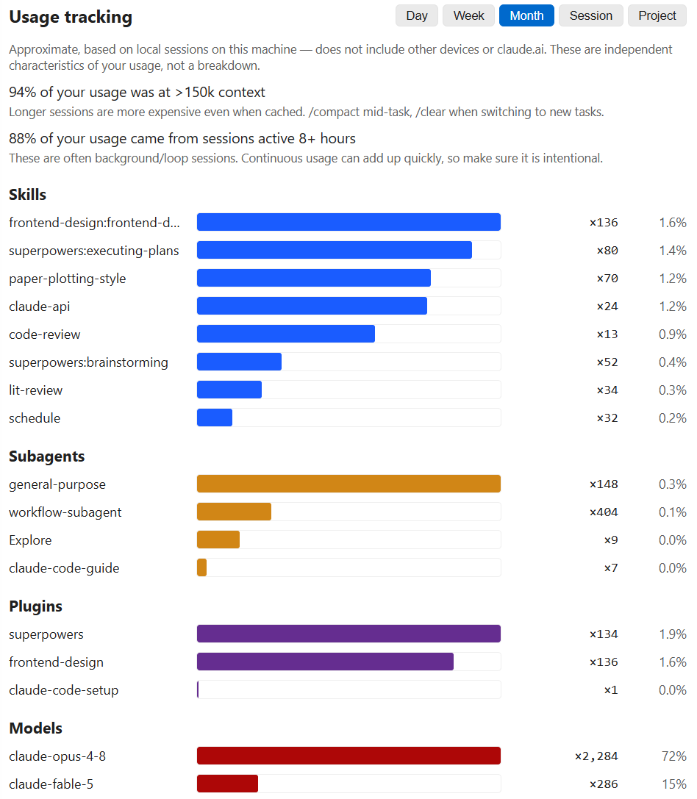
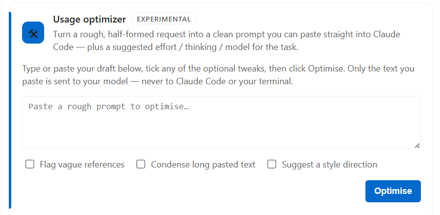

# Claude Code 使用量监控

🌐 **语言**: [🏠 Main](README.md) | [English](README-en.md) | [Deutsch](README-de-DE.md) | [繁體中文](README-zh-TW.md) | **简体中文** | [日本語](README-ja.md) | [한국어](README-ko.md) | [Português (Brasil)](README-pt-BR.md) | [Bahasa Indonesia](README-id.md)

---

**在 VS Code 本地查看 Claude Code 与 OpenAI Codex 的 Token 用量和额度。**
状态栏显示今日用量与周额度余量；仪表板可查看缓存、模型、会话、项目及可选的优化建议。
[从 VS Code Marketplace 安装](https://marketplace.visualstudio.com/items?itemName=growthjack.claude-code-usage)，
或阅读下方的[功能](#截图)、[安装](#安装)、[隐私](#隐私)与[贡献者致谢](#致谢)。
Claude 成本与 Codex API 等效价格均为估算，不是账单。

> **它是什么**：一个 VS Code 状态栏小工具，读取本地 Claude Code 与 Codex 用量日志，分别展示各自的 token、额度与估算值；还可提供可选建议，帮助减少不必要的消耗。
>
> **它不是什么**：账单工具。Claude 成本和 Codex API 等效成本都是估算值，不是订阅扣费或发票；实际账单请以对应供应商账号为准。Codex 额度仅是本地最后观测，不是实时余额。

> 截图包含中英文界面；各图标明主题与范围。

---

## 截图

### 状态栏


*今日成本 · 当前 session 成本 · 5 小时和每周配额利用率。*

将鼠标移到配额指示器上查看明细：


*来自真实 `/usage` 数据：利用率百分比，以及每个窗口的剩余时间与重置时刻。*
*你的方案计量的每一项每周上限都会各占一行，按模型划分的上限也在其中（名称由 Anthropic 提供，因此该行会跟随实际受限的模型）；若你启用了使用额度，也会一并显示。*

### 仪表板


*点击状态栏打开完整仪表板：堆叠 token 构成图、小时分布、缓存命中率、按 token 类型的成本构成，以及下方的按模型 / 按日表格。*

### v2.3 Codex 与对比


以上五张 v2.3 截图使用生产仪表板渲染器、合成夹具及 VS Code Light+/Dark+ 主题变量生成，不是个人用量或账单证据；原生 VSIX 安装单独验收。

- Codex 主状态项显示**今日已用 token**，周额度项显示**余量**：已用 36% 时为 `wk 64%`；悬浮卡保留已用进度条、重置时间和分行说明。额度来自本地最后观测，不是实时余额。
- Claude 配额格式在 ⚙ 设置中用下拉栏选择：默认布局、仅 5 小时、仅每周或自定义；只有选“自定义”才显示模板输入框。
- 周期详情默认折叠；分享设置位于图下方。分享工作台默认开启、可关闭；色阶可选分位数、对数或线性。
- CLI 调用只有留下带 usage 的持久会话日志才能计入。未保存会话的历史调用不能回填；今日和最近 30 天都采用配置时区。
- Projects 为两个供应商新增仅 Token 的 30／90 天“项目 × 日期”热力图与每日堆叠趋势，并保留精确提示、覆盖状态、有界行数和“其他项目”长尾。

### Content 标签页：看清 token 究竟花在了哪里



*估算各类内容的 token 占比：你的提示词 vs 工具结果（按工具）vs 助手输出 / 思考。这是优化使用的切入点，范围为最近 30 天（`advice.promptWindowDays`）。*

### AI 建议：先看本地证据，再决定是否发送

**Get AI advice** 现在打开统一的建议有效性界面：先用已物化的本地聚合解释观察、证据和条件式行动；用户可记录「有用 / 无用 / 已应用」，并在存在可靠同类任务时查看版本化的前后比较。比较账本只保存粗粒度指标、质量、覆盖率和版本，不保存提示词、正文、路径或 session ID；没有可靠配对时会明确显示证据不足。单条建议可暂停有限时间，期间移出默认摘要，到期或手动恢复后重新出现。

AI 个性化仍为可选项。自备 `advice.apiKey` 后，默认请求只含聚合数据；提示样本需要单独同意。界面会先展示将要发送的**完整请求及其规范字节**，随后必须另外点击「发送」才会调用配置的 Anthropic 或 OpenAI 兼容端点。密钥只进入请求头，不出现在预览中；没有默认、后台或订阅凭据请求。

撤回建议的数据授权会立即作废预览并取消在途建议请求，不等待本地存储写入；已经传出的字节无法追回。

### 用量优化器



粘贴进一条粗略、没成形的需求，获得一条干净、**可直接粘贴**的提示词（纯文本、无 Markdown），并附上推荐的 effort / thinking / 模型（以小标签显示）。三个可选开关进一步微调（标出含糊指代 · 压缩长粘贴内容 · 建议风格方向）。实验性，默认关闭；**只发送你粘贴的文字**，不碰你的文件、不进终端。它与 AI 建议共用完整请求预览、单独发送、取消和严格响应解析边界。

---

## 2.4 新功能

<details open>
<summary>当前版本：状态栏、滚动体验与统一分享工作台</summary>

- **计价诊断防护**：未知模型警告在每次扩展宿主运行期间去重并设置总量上限，
  修复 [#122](https://github.com/ClaudeCodeUsage/ClaudeCodeUsage/issues/122) 报告的逐记录警告洪流。
  已经过期的内容分析文件保留空贡献，
  不再反复打断活跃日志的增量刷新。
- **新模型价格**：为 Opus 5.5、Sonnet 5.5、GPT-6.1 Sol、GPT-6 Sol 与 GPT-6 Luna
  配置独立的标准及缓存价格。未知 Codex 型号仍不计价，家族回退估算不会冒充精确计价覆盖率。
- **刷新容错与容量限制**：异常模型字段不再拖垮整批索引；不安全的对象键不会污染共享原型。
  每轮更新仅复制一次统计桶，后台结果队列设有容量边界，手动价格刷新限制响应大小、
  模型数量、并发请求及等待时间。
- **减少刷新打扰，明确恢复状态**：暂停自动刷新同时作用于两个供应商页面，后台索引与
  状态栏仍继续更新；手动刷新仍可用。失败保留已验证数据，并显示简短提示。主日志覆盖率、
  小时回填与等待重试分开显示；未变化的隐藏页签和每周用量复用有界缓存。
- **预览与设置一致**：AI 预览显示实际地址、协议和模型，不静默切换供应商。分享卡导出
  使用已接受的 SVG，改动控制项后必须重新预览。恢复默认保留 API 密钥；即使 Codex
  目录识别失败，也可在两个供应商的设置页修改目录。
- **大历史刷新优化**：未变化的内容归因复用数据，AI 控件仍实时更新；显示设置不再导致
  已完成的索引工作重复冷读，迟到索引结果也不能覆盖刚更新的价格。
  今日用量归因按自然日缓存，同一小时内的未变化轮询可更新倒计时，不遍历全量历史；
  整点刷新隐藏面板时，内容周归因仍重新计算一次。
- **升级兼容保护**：未变化的轮询保留已确认分享预览；切换 Claude 目录即清空旧来源数据，
  不受页面暂停影响。已有 API 密钥且未明确设置协议时，保留旧 Anthropic 协议。
  若预览提示不匹配，请在设置中明确选择目标 API 格式与地址，再预览后发送；升级或恢复
  默认不会把这把密钥静默转到新的 DeepSeek 默认地址。新安装采用匹配的 OpenAI 兼容格式。
- **Codex 状态栏与滚动**：默认简短指标显示今日已处理 Token，独立的每周额度显示
  剩余比例。滚动期间面板刷新短暂延后，且有最长等待边界。
- **统一、预览优先的分享工作台**：全宽导出预览位于视觉中心，控制项统一放在下方；
  一个呈现方式选择器即可切换**综合活动热力图**、**Claude 分享卡**与 **Claude token
  热力图**。综合呈现只在两个供应商都有真实数据时出现，后两种旧版呈现仍只使用 Claude 数据。
- **兼容入口，不再重复面板**：`exportShareCard`、`exportHeatmap` 与
  `publishHeatmapToGitHub` 继续保留，并打开对应预览。`enableShareCard` 仍是唯一可见的
  分享开关且默认开启；退役的 `showHeatmap` 仅为一个版本的状态兼容与有界清除而保留。
- **严格的本地产物与供应商边界**：切换、预览和本地 SVG/Markdown 导出只使用已物化聚合，
  不发起网络请求，也不登录 GitHub 或获取 profile／头像／名称。只有 Claude 热力图中独立的
  **发布到 GitHub** 动作可以联网；它仍仅支持公开仓库，并在写入前确认精确目标及创建／覆盖动作。
  综合活动不代表账单、生产率、能力或跨供应商等价。


此图来自生产渲染器、合成用量与 VS Code 主题变量；不是已安装 VSIX 或真实账号的截图。

</details>

## 2.3 新功能

2.3 系列加入 Codex 本地用量、独立于 Claude 的统计口径、对比视图与每周等效估算；
后续补齐月→日→小时下钻、项目活动矩阵和模型定价信息。
逐补丁详情见 [CHANGELOG.md](CHANGELOG.md)。

<details>
<summary>按主题查看 2.3 的技术细节</summary>

### 模型、Token 与计价


- **2.3 系列持续完善**——新增 GPT-6 Astra、Fable 5.1 模型元数据与可选
  AWS Bedrock 定价，提供固定参考汇率币种选择、仅 Token 的 30／90 天项目
  活动矩阵、完整的月/日/小时下钻、保留界面状态的刷新、无障碍图表，以及更低的 watcher/标题索引开销。
  逐补丁明细只保留在 CHANGELOG 与 GitHub Releases。
- Codex 用量记录只会从 `sessions/**/*.jsonl` 与 `archived_sessions/**/*.jsonl` 中发现；凭据、数据库和未知文件仍明确排除。此外，插件会精确流式读取 `$CODEX_HOME/session_index.jsonl`，仅将 `id` 映射为 `thread_name`，用于真实线程标题。标题中的绝对路径会先脱敏，标题只保留在内存。用量 JSONL 会逐行流式、临时解析，以提取白名单内的用量与结构元数据；提示词、回复、命令和工具参数字段不会被检查或用于分析，也不会被保留或持久化。
- **已处理** = 输入 + 输出；**未缓存用量** = 未缓存输入 + 输出；**缓存输入**仍是输入的子集，reasoning 仍是输出的子集。概览还会按「缓存输入 / 输入」显示输入缓存命中率。Codex 不显示账单成本；首张汇总卡会针对当前范围显示明确标注的 API 等效成本估算，「全部时间」则按同一定价口径展示每周趋势。Claude / Codex / Compare 仍保持各供应商口径独立。
- Codex 的**今天**指配置时区中的当前自然日。页面会显示精确的小时 API 等效成本，并把 Token 构成作为独立视图；每日与每月主图也默认显示 API 等效成本，Token 构成仍单独保留。只有精确匹配的已知模型才参与计价，未知模型保持未定价，定价覆盖率始终可见。这个兼容 schema 3 的增量小时 sidecar 保存滚动最近 30 天的稀疏日期 / 小时桶，支持检查点与续传、淘汰第 31 天，并在展开日期时不读取 JSONL。Codex 按月图表和表格按月份从旧到新显示。
- 单次请求 Token 归因优先采用有效的 `last_token_usage` component；其中 `total_tokens` 表示活跃上下文大小，不是该请求的用量。只有完整的 total-plus-last 数字签名能证明同一伪名 rate-limit 来源或紧邻记录发生重放时才去重；缺少 last snapshot 时回退为 cumulative lineage high-water。升级后会自动重建一次索引，期间持续显示已索引小计。
- Claude 与 Codex 的「全部时间」/「对比」会直接根据本地 Token 日志计算历史已用等价值。最新且有效的官方重置观测会锚定一组唯一、互不重叠的每周周期，每条用量只计入一个周期；没有可用观测时，仅已用历史才回退到 UTC 周一至周一的自然周。只有真正不同 quota series 且其未来重置重叠、未对齐时才视为冲突；同一 series 的观测仍保持为一个 series，并可按低可信度近似显示，不会再生成第二个「当前周期」。周期范围与重置时刻会分开表达。Codex 的 account-wide `codex` 观测可以同时装饰历史和当前周期；如果重置时间偏离七天网格，就按观测时间映射到对应展示周期。文件来源、重置漂移或日切片跨边界时仍可给出总额度近似，但会降低可信度并标注为近似。文件键不是账号身份，因此同一 home 中符合条件的本地文件会一起参与；即使本地 quota series 重叠，当前周期仍采用最后一次真实观测给出低可信度混合估算；归属不清的已结束周期或没有可用观测的周期保持仅已用值，不会虚构账号拆分。任何内部一致且有观测的周期（包括当前周期）都可以显示总额度和未用耐用度估算；归属或边界不确定时降低可信度，而不是静默显示破折号。Codex 用量按日切片保存，Token 仍只计入一个周期；该显示规则不改变索引 schema，也不会触发重建。历史统一套用当前官方 API 单价；这是代理估算，不是账单、官方余额或官方订阅价格。该面板默认开启，可在设置中通过 `showWeeklyEquivalentValue` 关闭。Claude 从此版本开始按本地 profile 记录额度观测。
- 切换到 Codex 后仍沿用既有的今天 / 最近 30 天 / 全部时间 / 会话 / 项目 / 内容 / 设置结构，并按 Codex 语义调整标签。两个供应商复用同一组渲染函数、HTML class、图表、表格、间距和响应式规则；时间序列图保持宽度对齐，密集内容只在各自区域内滚动。Codex 建议使用已索引的 30 天结构化证据。
- 根任务使用经过路径脱敏的最新真实线程标题；子任务优先使用自己的真实线程标题，缺失时使用其上报的昵称并显示父级 / 根任务标题；这些信息仍缺失时采用本地化的中性回退名称。项目名称使用 Git 仓库名，非 Git 目录则使用文件夹的末级名称。插件不会虚构无法可靠统计的 Branches 或 Workflows。
- 最近 7 天与 30 天按配置时区中的事件发生日精确切片。迁移或重建未完成时，Codex 的卡片、表格、项目、会话、建议与状态栏都会明确标为**已索引小计**，并排除未经验证的旧版总量。检测到 Codex home 后会立即显示供应商标签；首次建立索引期间在页面内实时显示精确的已索引文件数、百分比与容量进度，「对比」则等到两个供应商都有真实数据后才出现。生成首个原子检查点后，完整的小计仪表盘会在索引继续期间保持可用；进度提示不会替代卡片和表格。所选 Codex home 不区分账号，因此同一目录中多个登录账号留下的日志会合并统计；本地日志没有可靠的账号身份字段，额度卡只能保留**最后观测**，不会相加。
- 每条建议仅在已索引的 30 天结构聚合有证据时展示观测、易读证据和条件式行动；没有证据就不会生成泛化建议。
- 持久索引保存使用本机盐值生成的假名化键、数值与结构聚合，以及经过脱敏的项目、目录、agent、模型、effort、角色、时间和质量元数据；绝不保存原始 ID、完整路径或仓库 URL、线程标题或对话正文。
- 共享设置标签页在 Codex 下只显示通用和对 Codex 有效的选项。Codex 数据收集和本地 Codex 建议可分别关闭；后台监听延迟可配置（默认 30 秒，也可关闭或选更长间隔）。首次建立索引或旧索引迁移尚未收敛时，会获得一次受限的 64 GiB / 16,384 文件轮次流式上限；这不会预先占用等量内存，并且仍可取消、可续传。收敛后，后台任务恢复为 128 MiB / 64 文件轮次，始终可见的「刷新」使用 2 GiB / 512 文件轮次。未变化的常规刷新仍不会读取用量 JSONL 正文。

</details>

## 2.2 新功能

<details>
<summary>分享、会话查看与用量分析</summary>


- **用量分享卡**（可选，`enableShareCard`）：一张可配置的单页 SVG 用量卡——自选时间范围 × 范围（总体 / 工程 / 会话）× 展示哪些指标，以及主题（**Claude 经典橙** / **奶油** / **极光暗色** / **自动**）。预览和本地导出不会获取 GitHub 身份数据。自包含、可复现；提示词、路径、ID 一律不出本机。中文语言下使用 万/亿 单位。
- **只读会话查看器**（会话标签，**默认开启**）：每行的「查看」按钮以只读方式重开某个历史会话的提示词与 Markdown 渲染的回答，帮你回忆内容，而**不必**像「恢复」那样把它重新塞回模型上下文。思考与工具调用收进折叠区，默认展示最近若干轮。
- **Token 热力图**（可选，`showHeatmap`）：All 标签顶部的 GitHub 风格年度 token 热力图，并可**导出 / 发布到你的 GitHub 主页**（自包含 SVG，一键复制 Markdown 嵌入代码）。
- **实验性洞察**（可选，`showInsights`，Content 标签）：基于本地日志的启发式估算（均标注为估算）——**缓存损耗账单**（模型切换 / 空闲导致重写缓存的花费）、**各模型缓存保温时长**、**大单轮**、**你的活跃时段**、以及**技能 ROI**（每美元产出的输出 token）。
- **最贵的 10 条消息**（可选，`showCostliestMessages`）：按成本排序单轮对话，区分**缓存未命中**与长回答，附缓存命中率与距上一轮的间隔。
- **会话「活跃」列**：每个会话的估算实际操作时长（空闲间隔按 1.5 小时封顶），比原始的首尾时间跨度更有意义。
- **缓存命中率列**：All-time（按月）与本月（按日）表格及其下钻均新增该列，逐行可见缓存效率。
- **实时刷新延迟**（`fileWatchSeconds`：关 / 1 / 2 / 5 / 10 / 20 / 30 秒）取代原来的开 / 关切换；只重读**本地**日志。
- **时区感知分桶**：Today / 日 / 月 / 小时 的统计都以你配置的 IANA 时区为准（下拉含完整 UTC 偏移），彼此之间以及与 Anthropic 控制台保持一致。
- **升级后「新功能」提示**：每次首次运行新的 major.minor 版本时给一次可关闭的提示，让可选功能不被埋没。
- **修复**：Sonnet 5 正确上报 1M 上下文窗口（#50）；日志带 TTL 拆分时，1 小时缓存写入按 2× 基础输入计价（#62）；多窗口下后台窗口在获得焦点时刷新、不再显示过期数据（#55）；时区设置改为校验过的下拉框，非法值不再拖垮仪表板（#51）；德语（de-DE）与巴西葡语（pt-BR）在各处均可选。

</details>

## 2.1 新功能

<details>
<summary>会话、工作流、设置与 AI 建议</summary>


- **会话：恢复 / 拷贝 / 删除**：每行可拷贝会话 ID、**恢复**（本工程会话优先在官方 Claude Code 扩展的新 tab 打开；其他工程的会话在其所在目录开终端执行 `claude --resume <id>`，因为官方 in-tab 恢复用的是当前工作区目录、找不到跨工程会话）、或**删除**（移至回收站，需确认）。并新增「当前工程 / 全部」筛选，默认当前工程。
- **配额显示选项**：`quotaFiveHourOnly`（只显示 5 小时配额窗口）、`showResetInStatusBar`（在状态栏配额后附加重置倒计时，如 `5h:50%:2.3h | wk:30%:3.2d`），均在 ⚙ 设置标签页中。（想隐藏金额：把现有的「状态栏指标」切到 tokens 即可。）
- **详情页加宽**：详情页加宽至 1600px，窄屏下仍自适应。
- **工作流标签页**：所有多代理运行集中查看：动态工作流（ultracode）和临时子代理批次，含每次运行的成本、代理数、所用模型、**缓存命中率**（"我的供应商是否适配工作流"的诊断信号），以及按任务内容标注的逐代理明细。
- **用量追踪面板**：对标官方 `/usage` 的"用量构成"视图，但支持全部模型 / 供应商和五档范围（日 / 周 / 月 / 会话 / 项目）：>150k 上下文占比、8 小时以上会话占比、子代理密集占比、工作流占比，以及 Skills／子代理／插件／模型四类细分。今日标签页有精简卡片。
- **思考占比**：每会话的估算思考 token 占比（Sessions 列 + 今日卡片），过高时提示改用 `/effort`。
- **工作流配额护栏**：当 5 小时窗口剩余不足以完成一次运行时，仪表板显示可关闭的警告横幅（`claudeCodeUsage.workflowQuotaWarnPercent`）。
- **设置搬进仪表板**：新增 ⚙ 设置标签页，就地管理大多数选项；VS Code 原生设置保留语言及 Claude/Codex 数据目录。自备 AI 密钥在仪表板填写、保存在 SecretStorage，不随 Settings Sync 同步。右上角按钮精简为 ✨ AI 建议 和 ⚙ 设置（都跳到对应标签）；自动刷新开关挪进设置（暂停时右上角才出现手动 ↻）。如果你把成本、配额、上下文三项**全部隐藏**，状态栏会保留一个小图标作为回到仪表板的入口。
- **状态栏指标**（`statusBarMetric`）：默认显示今日成本，也可切换为今日**总 token** 消耗（紧凑 k/M）。
- **模型专属每周上限**（`showScopedWeekly`，可选开启）：显示 Anthropic
  实际返回的受限模型名称，例如 `fable 17%`；由 PR #38
  （[@wheelbarrel00](https://github.com/wheelbarrel00)）最初的
  模型专属额度功能演进而来。
- **AI 建议 2.0 的兼容基础**：继续支持自备 key 的 Anthropic（`/v1/messages`）与 OpenAI 兼容端点（`advice.apiFormat`）、超时、重试和 curl 兜底；2.3 系列将旧入口收敛到统一的本地证据、完整请求预览、明确发送和反馈边界。订阅凭据从不用于模型请求。
- **用量优化器**（实验性，`advice.optimizer.enabled`，默认关闭）：Content 标签页的一张卡，粘贴进粗略需求，返回一条精炼提示词，以**纯文本**形式（可直接粘贴、无 Markdown），并附推荐的 effort / thinking / 模型。三个可选微调项（标出含糊指代 · 压缩长粘贴内容 · 建议风格方向）。先生成包含所粘贴文字的精确请求预览；只有随后明确点击发送才会访问配置的 BYOK endpoint。
- **上下文窗口指示器**（实验性，默认关闭）：在设置里开启后，状态栏显示当前 session 的上下文占用。`~` 表示窗口大小是猜测；代理 / 自定义模型可用 `contextWindowOverride` 手填真实窗口。

</details>

## 2.0 新功能

<details>
<summary>官方额度、新标签页、定价与实时状态栏</summary>


- **真实的 5 小时和每周配额** 显示在状态栏：OAuth 会话跟随当前窗口所选的 Claude profile，优先级为显式 `dataDirectory`、首个有效 `CLAUDE_CONFIG_DIR`、最后 `~/.claude`；macOS 钥匙串仅用于默认 profile。借鉴上游 [PR #9](https://github.com/ClaudeCodeUsage/ClaudeCodeUsage/pull/9)（[@Dobidop](https://github.com/Dobidop)）。
- **四个新标签页**：Sessions、Projects、Content、Branches，均可排序。
- **堆叠 token 构成图**，含 Y 轴和参考线。
- **AI 建议命令**现在转到统一的本地证据界面；没有自备 key 时请求保持未发送，不再打开另一套 demo 路径。
- **多厂商定价**：Opus 4.x、Sonnet 4.x、Haiku 4.5 对照 Anthropic 官方定价；OpenAI、Gemini、DeepSeek、Kimi、GLM、Qwen 等代理场景的参考价，含家族感知回退。`Refresh Token Pricing` 可拉取 LiteLLM 即时价格。
- **自定义时区** 用于日期显示（`claudeCodeUsage.timezone`）。
- **浅色主题标签可读性** 修复。
- 全程 **locale 感知的数字与日期**（德语用 `.`，英语用 `,`）。
- **实时状态栏**：基于 `fs.watch`（1.5s 防抖）+ 空闲跳过 + 非阻塞加载（每 25 个文件让出事件循环）。

完整变更：[CHANGELOG.md](CHANGELOG.md)。

---

</details>

## 安装

### VS Code Marketplace

在扩展视图（`Ctrl+Shift+X`）搜索 **`Claude Code Usage`**，或：

```
ext install GrowthJack.claude-code-usage
```

### Cursor / Windsurf / Antigravity（Open VSX）

同一扩展也发布在 [Open VSX Registry](https://open-vsx.org/extension/GrowthJack/claude-code-usage)。

### 从 `.vsix` 文件安装

`Ctrl+Shift+P` → **Extensions: Install from VSIX...** → 选择下载的 `.vsix`。

---

## 配置

**绝大多数设置现在都在仪表板里。** 打开仪表板（运行 **Show Usage Details**，或点右上角 ⚙），用 **⚙ 设置**标签页 —— 分为「常规 / 状态栏 / 数据与刷新 / AI 建议与优化器」。改动即时生效。

为了让 VS Code 原生设置 UI 保持清爽，只保留以下三个普通设置；自备 AI 密钥请在仪表板的 ⚙ 设置中填写，它只存入 SecretStorage，不随 Settings Sync 同步。打开 VS Code 设置（`Ctrl+,`）搜索 **`Claude Code Usage`**：

| 设置 | 默认 | 作用 |
|---|---|---|
| `language` | `"auto"` | 界面语言：`auto` / `en` / `de-DE` / `zh-TW` / `zh-CN` / `ja` / `ko` / `pt-BR` / `id`。 |
| `dataDirectory` | `""` | 自定义 Claude 数据目录；留空 = 自动检测。 |
| `codex.dataDirectory` | `""` | 自定义 Codex 数据目录；留空 = `CODEX_HOME` 或 `~/.codex`。 |

其余全部 —— 刷新间隔、状态栏各项、数字 / 日期格式、项目分组、内容分析，以及所有 AI 建议 / 优化器选项 —— 都在仪表板的 ⚙ 设置标签页里。升级不丢配置：首次启动会做一次性迁移，把你 `settings.json` 里已有的值搬过来。

如需自定义 Claude 配额状态栏，在 ⚙ 设置中选择“自定义”。模板支持 `{5h.pct}`、`{wk.pct}`（或 `{7d.pct}`）和 `{model:Fable.pct}`；每个窗口也支持 `.label`、`.reset`，重置样式可用 `:decimal`、`:units`、`:clock`、`:at`，例如 `{5h.pct} | {wk.reset:at}`。未报告的窗口及其分隔符会省略；选“默认”则沿用原有额度选项。

---

## 成本是如何计算的

状态栏成本为各模型按 **`Σ (tokens × 每百万单价)`** 求和（覆盖输入、输出、缓存写入、缓存读取）。

- **每百万单价** 来自内置定价表，对照 Anthropic 官方定价页验证，并为可能出现在代理场景的非 Anthropic 模型补充参考价。
- **`Refresh Token Pricing`**（命令 + 仪表板按钮）从 [LiteLLM 公开数据集](https://github.com/BerriAI/litellm)拉取即时价格作为运行时覆盖。
- **未知模型快照** 按其所属家族（Opus / Sonnet / Haiku / GPT / Gemini / DeepSeek / Kimi / GLM / Qwen）的当前档位定价，而非盲目回退。

状态栏**不知道**：

- 你实际的 Anthropic 账单（折扣、免费额度、套餐上限）。
- 你的代理供应商是否采用不同费率。
- 任何未记录在本地 `.jsonl` 日志中的内容。

**5h / 每周配额指示器**则不同，它通过 OAuth 会话查询 Claude Code 真实的 `/usage` 端点，显示 Anthropic 为你的账户记录的实际百分比。该数值是权威的。

---

## 隐私

完整数据清单、保留期、迁移、清除和远程边界见
[本地数据与隐私](LOCAL-DATA.zh-CN.md)（[English](LOCAL-DATA.md)）。

| 数据 | 本地保留 | 远程行为 |
|---|---|---|
| 源日志 | 供应商拥有、只读；不整份复制 | 默认无 |
| Codex 索引 | 有界匿名数值/结构聚合 | 无 |
| 额度历史 | 有界匿名窗口观测，不含原始账号 ID | 启用时仅 Claude 查询额度；Codex 证据留在本地 |
| UI/分享状态 | 筛选及可选标题/范围/GitHub 目标字符串 | 仅精确确认后发布 |
| 建议状态/密钥 | 有界聚合证据；密钥仅在 SecretStorage | 另行点击发送后才传输精确预览过的请求 |

- 所有 token / 成本 / session 分析都在**本地**进行，只读取你的 `~/.claude/projects/**/*.jsonl` 文件。
- 配额指示器用 Claude Code 现有的 OAuth token 调用 **`api.anthropic.com/api/oauth/usage`**。如 token 已过期，插件会将现有 refresh token 发送至 **`console.anthropic.com/v1/oauth/token`**，并把刷新后的凭证写回选中的 Claude 凭证文件或 macOS 钥匙串。详见[本地数据与隐私](LOCAL-DATA.zh-CN.md)。
- **AI 建议**和**用量优化器**是仅有的会调用模型的功能，而且只在你查看完整请求后再次主动点击「发送」时调用。AI 建议默认只发送聚合证据；提示样本与用户上下文需要独立同意，并完整出现在预览中。优化器只包含你粘贴的文字。两者仅使用 `advice.apiUrl` 与自备 `advice.apiKey`；密钥只进入请求头，插件不使用订阅凭据，也没有后台请求。

### 已知限制

- 从未出现在官方或本地结构化证据中的重置无法重建；只有日粒度时可信度会下降。
- 一个 Codex home 可能包含多个登录；当前周期会用最后一次真实观测给出低可信度混合估算，归属不清的已结束周期保持仅已用值，不虚构账号拆分。
- API 等效价值受当前公开单价与可见定价覆盖率影响，不是账单或订阅价格。
- 源日志保留期由 Claude Code/Codex 控制；明确的清除控制才是移除插件派生状态的可靠方式。

---

## 疑难排解

**"无 Claude Code 数据"**
- 确认 Claude Code 已安装并至少使用过一次。
- 检查 `dataDirectory` 设置；自动检测会查 `~/.claude/projects` 和 `~/.config/claude/projects`。

**一次性 Claude CLI 调用没有计入**
- 使用 `--no-session-persistence` 的调用可能只留下提示历史，不会写入项目转录，
  也没有 token `usage` 字段。插件不会根据提示历史虚构 token 或成本。希望后续
  审计调用计入时，请不要使用该参数；过去未持久化的 token 用量无法在本地重建。

**配额行显示 `5h:--% wk:--%`**
- Claude Code 的 OAuth token 缺失或过期。请登录一次当前 Claude profile。凭证按显式 `dataDirectory`、首个有效 `CLAUDE_CONFIG_DIR`、最后 `~/.claude` 的顺序选择；全局 macOS 钥匙串条目不会替代已选中的自定义 profile。

**切换 workspace 后配额消失**
- 已修复：在同一个窗口里切换打开的文件夹时，配额会自动重新拉取，无需新开窗口。

**`Get AI Usage Advice` 返回 404**
- 核对 API 格式、地址与模型。DeepSeek 的 OpenAI 兼容格式使用
  `https://api.deepseek.com/chat/completions`；明确选择 Anthropic 兼容格式时，其基地址为
  `https://api.deepseek.com/anthropic`（[官方说明](https://api-docs.deepseek.com/guides/anthropic_api/)）。
  预览会显示最终请求地址；扩展不会静默切换供应商或删除已配置的代理前缀。

**`Get AI Usage Advice` 无法发送**
- AI 个性化需要自备 key。若 `claudeCodeUsage.advice.apiKey` 为空，仍可查看本地证据，但发送按钮不可用且不会调用 API；在设置中填入 key 后，先核对完整请求预览，再单独点击发送。

**大历史下 CPU 占用高或刷新缓慢（包括 Linux）**
- V2.2.1 移除了 active 状态下隐藏的 8 秒轮询覆盖，并限制首时间戳扫描。
  在安装 V2.2.1 前，可先把**实时刷新延迟**设为**关闭**，把**刷新间隔**设为
  **300–900 秒**，并视需要关闭**内容分析**。只关闭“仪表盘自动刷新”并不会
  停止状态栏所需的日志解析。
- 若 V2.2.1 仍持续高占用，请运行 **Show Diagnostic Logs**，只把匿名的
  `refresh:` 行附到 issue #70；其中只有计数和耗时，不含提示词、路径、
  session ID、凭证或原始日志行。

**历史记录消失或缺少早期月份**
- Claude Code 会自动删除超过 `cleanupPeriodDays`（默认 **30 天**）的对话日志。已删除的记录无法恢复。要保留更多历史，在 `~/.claude/settings.json` 中添加：
  ```json
  { "cleanupPeriodDays": 365 }
  ```
  此设置仅对之后生成的日志有效。感谢 [@nickearnshaw](https://github.com/nickearnshaw) 记录此项。

**Token 总数低于 Claude Code 的 `stats-cache`**
- 一次响应会在转录中产生 `thinking` 和 `text` 两条记录；它们带有相同的
  `messageId`、`requestId` 与完整 `usage` 向量。插件按响应身份只计一次，
  并保留该身份最大的向量；Claude Code 的 `stats-cache` 则按行累加。
  因此两者可能不同，插件不会用倍率去贴合缓存读数。

---

## 致谢

项目由 [@jack21](https://github.com/jack21) 创建、
[@Carl723000](https://github.com/Carl723000) 维护，也受益于社区的 PR、issue、审阅与翻译。
完整名单按**已合并 PR、issue 提报、未合并提案**分组，见
[主 README 的 Credits](README.md#credits)。这里不会把“提出问题”误写成“代码已合并”。
今后的 release 文档会在每项改动旁标注相应贡献者的 `@` 用户名，
而非只在末尾汇总。感谢所有贡献者。

开发工具 [Claude Code](https://claude.com/claude-code) 与
[OpenAI Codex](https://developers.openai.com/codex/) 单独致谢，
不代替人类贡献者署名。项目采用 [MIT 许可证](LICENSE)。

**欢迎提出 Issue、PR 与想法** —— 这正是项目成长的方式。

---

## 许可证

[MIT](LICENSE)
